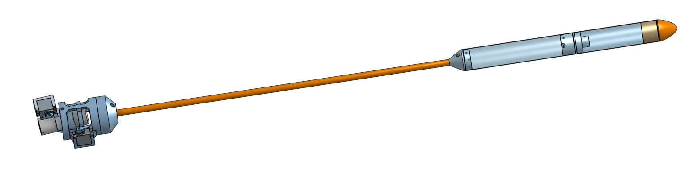

# Group 3 - Project beans

## Welcome to Project Beans.

Project Beans was a 2020 project by 6 VUW Engineering students to
deliver a model rocket for a client. An in-depth breakdown of the
projects scope, deliverables and current state can be obtained in-depth
within the documentation of this repository.

> Figure 1: Rocket Design Render

## Meet The Team

### Software

|  |  |  |
|:------------------------------------------------------------------------------------------------------------------------------------------------------|:---------------------------------------------------------------------------------------------------------------|:--------------------------------------------------------------------------------------------------------------|
| [Zac Scott](https://github.com/scottzach1)                                                                                                            | [Ron Crisostomo](https://github.com/crisosron)                                                                 | [Finlay Sargisson](https://github.com/sarrgi)                                                                 |

### Hardware

|  |  |  |
|:-------------------------------------------------------------------------------------------------------------------------------------------------------------|:-----------------------------------------------------------------------------------------------------------------|:---------------------------------------------------------------------------------------------------------------------------------------------|
| [Niels Clayton](https://github.com/Niels-Clayton)                                                                                                            | [William Fowler](https://github.com/Will-Fowler)                                                                 | [Billy Rob](https://gitlab.ecs.vuw.ac.nz/robbbill)                                                                                           |

