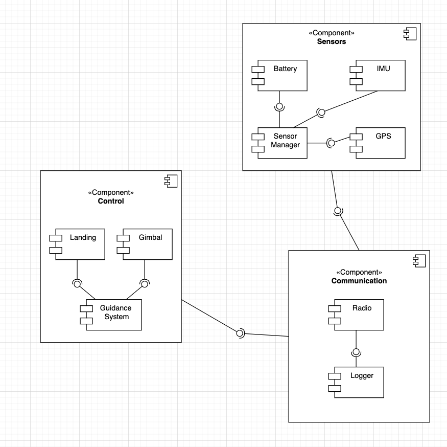

# ENGR 301: Architectural Design and Proof-of-Concept

## Proof-of-Concept

The aim of an architectural proof-of-concept (spike or walking skeleton) is to demonstrate the technical feasibility of your chosen architecture, to mitigate technical and project risks, and to plan and validate your technical and team processes (e.g., build systems, story breakdown, Kanban boards, acceptance testing, deployment).

A walking skeleton is an initial technical attempt that will form the architectural foundation of your product. Since a walking skeleton is expected to be carried into your product, it must be completed to the quality standards expected for your final product. A walking skeleton should demonstrate all the technologies your program will rely on "end-to-end" &mdash; from the user interface down to the hardware.

In the context of ENGR 301, a walking skeleton does not need to deliver any business value to your project: the aim is technical validation and risk mitigation.

## Document

The aim of the architectural design document is to describe the architecture and high-level design of the system your group is to build, to identify any critical technical issues with your design, and to explain how you have addressed the highest rated technical and architectural risks. The architecture document should also demonstrate your understanding of architectural techniques and architectural quality, using tools and associated notations as necessary to communicate the architecture precisely, unambiguously and clearly in a written technical document.

Page specifications below are *limits not targets* and refer to the pages in the PDF generated from the markdown. Because the size of your document is necessarily limited, you should ensure that you focus your efforts on those architectural concerns that are most important to completing a successful system: if sections are at their page limit, indicate how many items would be expected in a complete specification.

The ENGR 301 project architecture design document should be based on the standard ISO/IEC/IEEE 42010:2011(E) _Systems and software engineering &mdash; Architecture description_, plus appropriate sections from ISO/IEC/IEEE 29148:2018(E) _Systems and software engineering &mdash; Life cycle processes &mdash; Requirements engineering_; ISO/IEC/IEEE 15289:2017 _Systems and software engineering &mdash; Content of life-cycle information items (documentation)_; ISO/IEC/IEEE 15288:2015 _Systems and software engineering &mdash; System life-cycle processes_; ISO/IEC/IEEE 12207:2017 _Systems and software engineering &mdash; Software life cycle processes_ and ISO 25010 SQuaRE; with notations from ISO/ISE 19501 (UML). In particular, Annex F of ISO/IEC/IEEE 15288 and Annex F of ISO/IEC/IEEE 12207. These standards are available through the Victoria University Library subscription to the [IEEE Xplore Digital Library](https://ieeexplore.ieee.org/) (e.g., by visiting IEEE Xplore from a computer connected to the University network).

The document should contain the sections listed below, and conform to the formatting rules listed at the end of this brief.

All team members are expected to contribute equally to the document and list their contributions in the last section of the document (please make sure that your continued contribution to this document can be traced in GitLab). You should work on your document in your team's GitLab repository in a directory called "M2_Architecture". If more than one team member has contributed to a particular commit, all those team member IDs should be included in the first line of the git commit message. ``git blame``, ``git diff``, file histories, etc. will be tools used to assess individual contributions, so everyone is encouraged to contribute individually (your contribution should be made to many sections of the document, rather than focusing on just a single section), commit early and commit often.

---

# ENGR 301 Project *NN* Architectural Design and Proof-of-Concept

**Authors:** a comma-separated list of the names of each member of the team.

## 1. Introduction

One page overall introduction including sections 1.1 and 1.2 (ISO/IEC/IEEE 42010:2011(E) clause 5.2)

### Client

Identify the client and their contact details.

### 1.1 Purpose

One sentence describing the purpose of the system.

### 1.2 Scope

One paragraph describing the scope of the system.

### 1.3 Changes to requirements

If the requirement have changed significantly since the requirements document, outline the changes here. Changes must be justified and supported by evidences, i.e., they must be substantiated. (max one page, only if required)

## 2. References

References to other documents or standards. Follow the IEEE Citation Reference scheme, available from the [IEEE website](https://ieee-dataport.org/sites/default/files/analysis/27/IEEE%20Citation%20Guidelines.pdf) (PDF; 20 KB). (1 page, longer if required)

https://www.cs.ubc.ca/~gregor/teaching/papers/4+1view-architecture.pdf [1] (Viewed 27/5/2020) 
https://www.aviation.govt.nz/assets/rules/consolidations/Part_101_Consolidation.pdf [2] (Viewed 12/06/2020)

## 3. Architecture

Describe your system's architecture according to ISO/IEC/IEEE 42010:2011(E), ISO/IEC/IEEE 12207, ISO/IEC/IEEE 15289 and ISO/IEC/IEEE 15288.

Note in particular the note to clause 5 of 42010:

_"The verb include when used in Clause 5 indicates that either the information is present in the architecture description or reference to that information is provided therein."_

This means that you should refer to information (e.g. risks, requirements, models) in this or other documents rather than repeat information.

### 3.1 Stakeholders

> See ISO/IEC/IEEE 42010 clause 5.3 and ISO/IEC/IEEE 12207 clause 6.4.4.3(2).
> For most systems this will be about 2 pages, including a table mapping concerns to
> stakeholder.

##### Client
- Avionics package must maintain the same functionality as was required last year:
    - Implement some form of control system, guiding the rocket
    - Interface with and control a gimbal
    - Log all flight data and calculations for later analysis
    - Communicate with the base station, relaying real time flight data
    - All code and schematics will be completely open source 

- Designed PCB should be accessible to the wider rocket building community:
    - Easy to order from sites such as JLC-PCB
    - Parts will be accessible within New Zealand
    - Software will be easy to flash to the BCP, and will be well documented
       
- Designed PCB must be smaller than the previous years attempt

#### Software developers / Testers
- The avionics package development environment will allow for easy deployment of software to the package hardware
- The avionics package development environment will allow for feedback from the avionics package, used to monitor performance of the package while in use. 
- The avionics package will consist of a series of modules, each with defined responsibilities. 

#### School of Engineering and Computer Science (ECS)
- ECS requires that all aspects of the avionics package are correctly licenced
- ECS requires that we follow all guidelines specified by them 

#### Wider Rocketry Community
- The avionics package is required to be open source so that it can be implemented and edited by the wider rocketry community. 
-The avionics package is required to be well documented.

#### Civil Aviation Authority 
- The avionics package must conform to the regulations specified in the CAA Regulations Part 101 [2]

### 3.2 Architectural Viewpoints

#### Logical
The logical viewpoint will describe the functionality that the system provides to the end user. This viewpoint will break the system down into its key concepts, this can be visualised as a class and state diagram. 

#### Development
The development viewpoint will describe the architecture that supports the processes involved in the software development cycle, and aims to address concerns regarding the management of the software. 

#### Process
The process viewpoint will describe the dynamic and non-functional requirements of the system. *TODO I currently dont know what we should put here as it dosent seem to fit with the hardware aspect of our project*

#### Physical 
The physical viewpoint details how the software will integrate with the hardware, mapping individual packages within the avionics package to their respective hardware. This viewpoint will discuss the availability, reliability, and performance of both the hardware and software system. 

#### Scenarios
The scenarios viewpoint will detail use cases that describe the interactions between users and the system. This will then allow for qualitative reviews of our given architecture.

### 4. Architectural Views

(5 sub-sections of 2 pages each sub-section, per 42010, 5.5, 5.6, with reference to Annex F of both 12207 and 15288)

Describe your system's architecture in a series of architectural views, each view corresponding to one viewpoint.

You should include views from the following viewpoints (from Kruchten's 4+1 model):

 * Logical
 * Development
 * Process
 * Physical
 * Scenarios - present scenarios illustrating how two of your most important use cases are supported by your architecture

As appropriate you should include the following viewpoints:

 * Circuit Architecture
 * Hardware Architecture

Each architectural view should include at least one architectural model. If architectural models are shared across views, refer back to the first occurrence of that model in your document, rather than including a separate section for the architectural models.

### 4.1 Logical
...

### 4.2 Development
The development architectural viewpoint centers around the static organization of the software system that needs to be developed, and specifying the set of practices to be applied in the development of the software [1]. This viewpoint targets the project stakeholders that are involved with the development of the software.

#### 4.2.1 Software Module Organization
 
**Figure 1: UML Component Diagram of Software Module Organization**

Figure 1 describes the target software structure at an abstract level in the form of a UML component diagram. The diagram conveys 3 central high-level components, Control, Communication and Sensors. These 3 components serve as an abstraction of what the software system is capable of doing. Within each high-level component, there are modules that each represent some feature or functionality logically related to the higher level component.

##### Control
The Control component comprises of 3 main modules, the landing, gimbal and guidance system module. The landing module is independent of the gimbal module and vice versa, however, both modules require some input from the guidance system module to operate correctly. The guidance system will be responsible for calculations related to the flight of the rocket, and determining when the landing sequence should initiate, hence the 2 other modules depending on the guidance system module. At a higher level, the control component provides a service to the communication module. This was done to satisfy the requirement of stakeholders being able to monitor the flight at the base station.

##### Sensors
The Sensors component contains 4 submodules, Battery, IMU, GPS, and Sensor Manager. The Battery, IMU, and GPS will each interface with the corresponding on-board sensors of the rocket, whereas the Sensor Manager module serves as the access point of these sensors from a software perspective. Figure 1 shows that the Sensor Manager requires a service from the 3 other modules, but this relationship is one-directional, with none of the other modules requiring Sensor Manager to operate. This is due to the fact that the Sensor Manager will perform read-only operations on the other modules to send it to the Communication component for analysis and monitoring (as required by the client).

##### Communication
The Communication component contains 2 modules, the Radio module to enable communication between the base station and the 2 other components (Control and Sensors), and a Logger module to log data from the Control and Sensors components to locations where they are needed. The Communication component relies on the 2 other components, and as a result, this component may be the most instable of the 3 components.

##### Modularity and Reliability
In section 3.7 of the requirements document, it has been outlined that maintainability and extensibility of the software is a desired non-functional requirement to make it easy for future individuals to contribute to the project. To work towards this objective, it is important that the organization of the software system accomodates for the idea of modularity. Steps were taken to minimize the number of dependencies that need to exist between the components. However, it is simply unavoidable for dependencies to exist between modules that are logically related to each other. Furthermore, forcing a small number of dependencies should not compromise the reliability of the software system. The Communication component has the highest number of dependencies which means it is the most instable. Despite this, it is important to note that the Communication component should not affect the rocket's flight and physical state because this component does not provide any services to the 2 other components. This means that even when the Communication component fails, the failure should not propagate to the 2 other components, enabling the rocket to maintain a safe flight trajectory despite the failure.

#### 4.2.2 Development Environment and Practices

##### Gitlab Workflow
Git and GitLab are used in conjunction for the version control aspect of the project. The benefits of a platform such as GitLab is that in addition to version control, it provides a platform for project management and CI/CD.

- **Project Managing through GitLab** 
GitLab gives the ability to break down projects into well defined pieces in the form of **epics, sub-epics, milestones, and issues**. In the context of this project, the project team decided that each of these components corresponds to the following:  
    - **Epics** - Represents a phase in the project.
    - **Sub-epics** (An epic assigned as a child epic to another epic) - Represents a feature or user story relevant to the corresponding parent epic (Project Phase)
    - **Issues** - Specific, narrowly-scoped objectives that contribute to achieving its assigned subepic. Subepics should be associated with a collection of issues. Issues are assigned to 1 or more team members on a voluntary basis (as per the Scrum principles).
    - **Milestones** - Represents an iteration/sprint within a project. Each milestone will be assigned a start date, and a due date 2 weeks from the starting date. In each milestone, At least 1 sub-epic will be addressed, which in turn will address a range of issues. Each milestone will be assigned a board through GitLab. The board serves as a visual representation of the tasks that need to be undertaken for a sprint, and their current status (eg Open, To Do, Doing, Review, Closed)
     
- **Branching Strategy and Merge Requests** 
 The branching strategy adopted by the team involves the creation of a branch and merge request for every issue a team member decides to do. **The branch created must be branching off the master branch.** If more than 1 team member is assigned to an issue, those team members can decide if they want to create further individual branches that branch off the newly created branch.   

    **Figure 2: Branching Strategy Diagram**  
  
  The diagram in figure 2 follows a small example of only 3 issues being addressed in the sprint. Each issue has a branch and should be composed of multiple commits as represented by multiple nodes of the same color in the diagram. When the issue has been completed, the branch should be merged into the master branch via the merge request. After merging, the branch created for the issue will be closed, so should the corresponding issue.  
  
- **Completing an Issue and Merge Request**
  When the issue has been completed, it is the responsibility of the issue assignee to move the issue to the **review stage** via the sprint board, and assigning the issue the 'review' label. The merge request should be assigned the review label to indicate to other team members that the merge request is ready for reviewing. Relevant team members will be responsible for inspecting the changes applied through the merge request, and will have to provide an approval. **Each merge request must receive a certain number of approvals** before being able to merge its contents with the master branch. It is the responsibility of the team members to provide feedback and suggestions to the merge request as they see fit. After receiving the required number of approvals, the merge request can be completed by merging its corresponding branch to master and closing the merge request. The sourcce branch has the option to be closed with the merge request, however it is up to individual team members to make use of this feature.   

- _**TODO:**_ Write about CI/CD as more details become available

##### Agile Project Management
The project will be managed by observing agile project management principles. In particular, the Scrum agile project management methodology is used as a template on how to conduct the project. The project is conducted in 2-week sprints, with each sprint addressing at least 1 epic defined for the project. Sprint planning meetings will be conducted to obtain a sprint backlog, and to officially initiate the sprint. Brief sprint reviews will be conducted at the end of sprints to give the project team some insight on how the sprint progressed, and what could be improved.The usage of issue boards and limiting the number of tasks that can be in a single phase are inspired from the Kanban methodology of agile project management. This assists the project team in determining the status of issues, and finding out what still needs to be addressed. Regular meetings are also conducted to monitor and encourage the progress of each individual towards the issues they are aassigned to. By observing these ideas, team members are able to collaborate effectively, enabling the project the reach its goals in a systematic fashion.

_**TODO:**_ Write about any potential conventions with the selected programming language and tools used

### 4.3 Process
...

### 4.4 Physical
...

### 4.5 Scenarios
...

## 5. Development Schedule

_For each subsection, make clear what (if anything) has changed from the requirements document._ If unchanged, these sections should be copied over from the requirements document, not simply cross-referenced.

Schedules must be justified and supported by evidences; they must be either direct client requirements or direct consequences of client requirements. If the requirements document did not contain justifications or supporting evidences, then both must be provided here.

### 5.1 Schedule

Identify dates for key project deliverables:

1. prototype(s).
1. first deployment to the client.
1. further improvements required or specified by the client.

(1 page).

### 5.2 Budget and Procurement

#### 5.2.1 Budget

Present a budget for the project (as a table), showing the amount of expenditure the project requires and the date(s) on which it will be incurred. Substantiate each budget item by reference to fulfilment of project goals (one paragraph per item).

(1 page).

#### 5.2.2 Procurement

Present a table of goods or services that will be required to deliver project goals and specify how they are to be procured (e.g. from the School or from an external organisation). These may be software applications, libraries, training or other infrastructure, including open source software. Justify and substantiate procurement with reference to fulfilment of project goals, one paragraph per item.
(1 page).

### 5.3 Risks

Identify the ten most important project risks: their type, likelihood, impact, and mitigation strategies (3 pages).

### 5.4 Health and Safety

Document here project requirements for Health and Safety.

#### 5.4.1 Safety Plans

Safety Plans may be required for some projects, depending on project requirements.

## 6. Appendices

### 6.1 Assumptions and dependencies

One page on assumptions and dependencies (9.5.7)

### 6.2 Acronyms and abbreviations

One page glossary as required

## 7. Contributions

An one page statement of contributions, including a list of each member of the group and what they contributed to this document.

---

## Formatting Rules

 * Write your document using [Markdown](https://gitlab.ecs.vuw.ac.nz/help/user/markdown#gitlab-flavored-markdown-gfm) in your team's GitLab repository.
 * Major sections should be separated by a horizontal rule.

## Assessment

This document will be weighted at 20% on the architectural proof-of-concept(s), and 80% on the architecture design.

The proof-of-concept will be assessed for coverage (does it demonstrate all the technologies needed to build your project?) and quality (with an emphasis on simplicity, modularity, and modifiability).

The document will be assessed by considering both presentation and content. Group and individual group members will be assessed by identical criteria, the group mark for the finished PDF and the individual mark on the contributions visible through `git blame`, `git diff`, file histories, etc.

The presentation will be based on how easy it is to read, correct spelling, grammar, punctuation, clear diagrams, and so on.

The content will be assessed according to its clarity, consistency, relevance, critical engagement and a demonstrated understanding of the material in the course. We look for evidence these traits are represented and assess the level of performance against these traits. Inspection of the GitLab Group is the essential form of assessing this document. While being comprehensive and easy to understand, this document must be reasonably concise too. You will be affected negatively by writing a report with too many pages (far more than what has been suggested for each section above).

---
