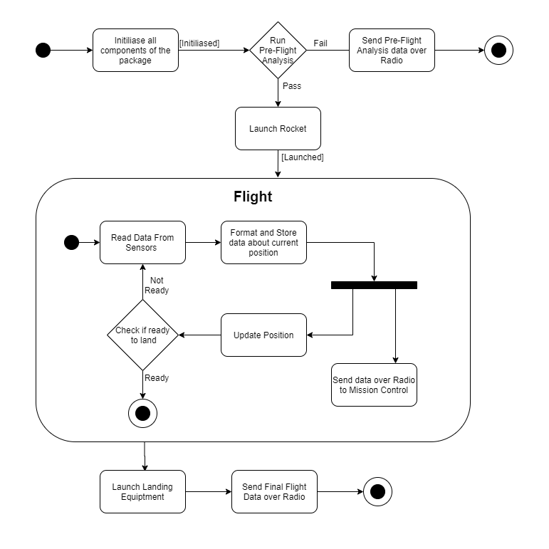

# ENGR 301: Architectural Design and Proof-of-Concept

## Proof-of-Concept

The aim of an architectural proof-of-concept (spike or walking skeleton) is to demonstrate the technical feasibility of your chosen architecture, to mitigate technical and project risks, and to plan and validate your technical and team processes (e.g., build systems, story breakdown, Kanban boards, acceptance testing, deployment).

A walking skeleton is an initial technical attempt that will form the architectural foundation of your product. Since a walking skeleton is expected to be carried into your product, it must be completed to the quality standards expected for your final product. A walking skeleton should demonstrate all the technologies your program will rely on "end-to-end" &mdash; from the user interface down to the hardware.

In the context of ENGR 301, a walking skeleton does not need to deliver any business value to your project: the aim is technical validation and risk mitigation.

## Document

The aim of the architectural design document is to describe the architecture and high-level design of the system your group is to build, to identify any critical technical issues with your design, and to explain how you have addressed the highest rated technical and architectural risks. The architecture document should also demonstrate your understanding of architectural techniques and architectural quality, using tools and associated notations as necessary to communicate the architecture precisely, unambiguously and clearly in a written technical document.

Page specifications below are *limits not targets* and refer to the pages in the PDF generated from the markdown. Because the size of your document is necessarily limited, you should ensure that you focus your efforts on those architectural concerns that are most important to completing a successful system: if sections are at their page limit, indicate how many items would be expected in a complete specification.

The ENGR 301 project architecture design document should be based on the standard ISO/IEC/IEEE 42010:2011(E) _Systems and software engineering &mdash; Architecture description_, plus appropriate sections from ISO/IEC/IEEE 29148:2018(E) _Systems and software engineering &mdash; Life cycle processes &mdash; Requirements engineering_; ISO/IEC/IEEE 15289:2017 _Systems and software engineering &mdash; Content of life-cycle information items (documentation)_; ISO/IEC/IEEE 15288:2015 _Systems and software engineering &mdash; System life-cycle processes_; ISO/IEC/IEEE 12207:2017 _Systems and software engineering &mdash; Software life cycle processes_ and ISO 25010 SQuaRE; with notations from ISO/ISE 19501 (UML). In particular, Annex F of ISO/IEC/IEEE 15288 and Annex F of ISO/IEC/IEEE 12207. These standards are available through the Victoria University Library subscription to the [IEEE Xplore Digital Library](https://ieeexplore.ieee.org/) (e.g., by visiting IEEE Xplore from a computer connected to the University network).

The document should contain the sections listed below, and conform to the formatting rules listed at the end of this brief.

All team members are expected to contribute equally to the document and list their contributions in the last section of the document (please make sure that your continued contribution to this document can be traced in GitLab). You should work on your document in your team's GitLab repository in a directory called "M2_Architecture". If more than one team member has contributed to a particular commit, all those team member IDs should be included in the first line of the git commit message. ``git blame``, ``git diff``, file histories, etc. will be tools used to assess individual contributions, so everyone is encouraged to contribute individually (your contribution should be made to many sections of the document, rather than focusing on just a single section), commit early and commit often.

---

# ENGR 301 Project *NN* Architectural Design and Proof-of-Concept

**Authors:** a comma-separated list of the names of each member of the team.

## 1. Introduction
Requirement: "One page overall introduction including sections 1.1 and 1.2 (ISO/IEC/IEEE 42010:2011(E) clause 5.2)"

For rockets ranging from NASAs Saturn V to an amateur rocket enthusiasts first rocket, stability is a desireable. The method in which stable flight is achieved varies to a large degree, but can be divided into two basic categories. The most common being passively stablized rockets. These maintain a stable flight due to passive aerodynamic features, an example being fins that give the rocket a stablizing rotation (similar to the effect of rifling on a bullet).
The simplicity of a passive system is apealing but any error introduced to the system can cause an unwanted flight trajectory. Some examples of sources of error include, unexpected wind or a fin of differing size that is not accounted for.
The second category is an active control system. Onboard electonics can be used to achieve active course correction. Error in the rockets trajectory can be mitigated in a way that passive systems cannot. The drawbacks of this are the complexity and large overhead introduced when constructing the rocket.

Our customer is one day hoping to launch a rocket from a weather balloon at approximately 70,000ft. This will require an active control system. This project aims to covering the need for an active control system. Existing off-the-shelf avionics packages for amateur rocketry enthusiasts are available, but our customer finds them lacking. This is due to limited functionality and with most packages not open source, so they cannot be reprogrammed. This project aims to improve on an existing attempt at this control system, completed in 2018, and is working along side other teams to ensure all aspects are covered.

### Client

Our client for this project is Andre Geldenhuis. Andre is a rocket enthusiast who is part of the NZ Rocketry Association. As of writing this, the contact email is "andre.geldenhuis@vuw.ac.nz" and throughout the project, the team can also contact Andre via a live text chat (Mattermost) channel.

### 1.1 Purpose
Requirement: "One sentence describing the purpose of the system(9.5.1)"

The purpose of this system is to control a rocket in flight while being opensource and accessible so that it can be used in the amateur rocketry community.

### 1.2 Scope

Requirement: "One paragraph describing the scope of the system(9.5.2)"

The objective is to deliver an avionics system that will allow stable controlled flight while simultaneously logging and broadcasting data. This system must improve on the existing avionics package created by a team in 2018 for Andre. There is no requirement on height or flight time, only to demonstrate controlled flight. The flight data must be logged to an onboard SD card, and the broadcast data must be accesed realtime by a onsite personal computer. The broadcast data must include the GPS position of the rocket. The rocket will use C or D class solid fuel engines.
The improvements on the 2018 avionics package are the reduction in onboard PCB size, and reliability in the field. To be considered more reliable the avionics package will have to initialize and launch on the first attempt, the package must also not have loose wires or bare electronics.

### 1.3 Changes to requirements

If the requirement have changed significantly since the requirements document, outline the changes here. Changes must be justified and supported by evidences, i.e., they must be substantiated. (max one page, only if required)

## 2. References

References to other documents or standards. Follow the IEEE Citation Reference scheme, available from the [IEEE website](https://ieee-dataport.org/sites/default/files/analysis/27/IEEE%20Citation%20Guidelines.pdf) (PDF; 20 KB). (1 page, longer if required)

https://www.cs.ubc.ca/~gregor/teaching/papers/4+1view-architecture.pdf [1] (Viewed 27/5/2020)
https://www.aviation.govt.nz/assets/rules/consolidations/Part_101_Consolidation.pdf [2] (Viewed 12/06/2020)

## 3. Architecture

Describe your system's architecture according to ISO/IEC/IEEE 42010:2011(E), ISO/IEC/IEEE 12207, ISO/IEC/IEEE 15289 and ISO/IEC/IEEE 15288.

Note in particular the note to clause 5 of 42010:

_"The verb include when used in Clause 5 indicates that either the information is present in the architecture description or reference to that information is provided therein."_

This means that you should refer to information (e.g. risks, requirements, models) in this or other documents rather than repeat information.

### 3.1 Stakeholders

> See ISO/IEC/IEEE 42010 clause 5.3 and ISO/IEC/IEEE 12207 clause 6.4.4.3(2).
> For most systems this will be about 2 pages, including a table mapping concerns to
> stakeholder.

##### Client
- Avionics package must maintain the same functionality as was required last year:
    - Implement some form of control system, guiding the rocket
    - Interface with and control a gimbal
    - Log all flight data and calculations for later analysis
    - Communicate with the base station, relaying real time flight data
    - All code and schematics will be completely open source

- Designed PCB should be accessible to the wider rocket building community:
    - Easy to order from sites such as JLC-PCB
    - Parts will be accessible within New Zealand
    - Software will be easy to flash to the BCP, and will be well documented

- Designed PCB must be smaller than the previous years attempt

#### Software developers / Testers
- The avionics package development environment will allow for easy deployment of software to the package hardware
- The avionics package development environment will allow for feedback from the avionics package, used to monitor performance of the package while in use.
- The avionics package will consist of a series of modules, each with defined responsibilities.

#### School of Engineering and Computer Science (ECS)
- ECS requires that all aspects of the avionics package are correctly licenced
- ECS requires that we follow all guidelines specified by them

#### Wider Rocketry Community
- The avionics package is required to be open source so that it can be implemented and edited by the wider rocketry community.
-The avionics package is required to be well documented.

#### Civil Aviation Authority
- The avionics package must conform to the regulations specified in the CAA Regulations Part 101 [2]

### 3.2 Architectural Viewpoints

#### Logical
The logical viewpoint will describe the functionality that the system provides to the end user. This viewpoint will break the system down into its key concepts, this can be visualised as a class and state diagram.

#### Development
The development viewpoint will describe the architecture that supports the processes involved in the software development cycle, and aims to address concerns regarding the management of the software.

#### Process
The process viewpoint will describe the dynamic and non-functional requirements of the system. *TODO I currently dont know what we should put here as it dosent seem to fit with the hardware aspect of our project*

#### Physical
The physical viewpoint details how the software will integrate with the hardware, mapping individual packages within the avionics package to their respective hardware. This viewpoint will discuss the availability, reliability, and performance of both the hardware and software system.

#### Scenarios
The scenarios viewpoint will detail use cases that describe the interactions between users and the system. This will then allow for qualitative reviews of our given architecture.

### 4. Architectural Views

(5 sub-sections of 2 pages each sub-section, per 42010, 5.5, 5.6, with reference to Annex F of both 12207 and 15288)

Describe your system's architecture in a series of architectural views, each view corresponding to one viewpoint.

You should include views from the following viewpoints (from Kruchten's 4+1 model):

 * Logical
 * Development
 * Process
 * Physical
 * Scenarios - present scenarios illustrating how two of your most important use cases are supported by your architecture

As appropriate you should include the following viewpoints:

 * Circuit Architecture
 * Hardware Architecture

Each architectural view should include at least one architectural model. If architectural models are shared across views, refer back to the first occurrence of that model in your document, rather than including a separate section for the architectural models.

### 4.1 Logical
**Overview**

The logical view is concerned with the functionality that the system
provides to the end-users from a heavily software oriented perspective. This encapsulates different characteristics
and responsibilities of the system such as those concerned with the
systems computation, communication and heuristic.

To help represent this, UML diagrams will be used to represent the
logical view, including both state and class diagrams. By reading these
diagrams, the reader should have a reasonable level of understanding of
the basic design and structure of the system. This representation will
only provide a rough overview, and to reduce noise, individual
implementations will be omitted.

**Class Diagrams**

The class diagrams will contain nodes that represent components within
the system. Some components of the system by nature have a lot of
inherent complexity. To provide better encapsulation of the system
entirely, the use of components within a system may be represented in
more depth via subcomponents. An example of how this may can be observed
by the use of subcomponents (Radio, Logger) within the Communication
component in Figure 1.

<b><i>FIXME: This may or may not be our desired implementation!</b></i>

For all leaf nodes (no sub-modules) within the class diagram, there will
be internal attributes that map characteristics of the respective
components.

***Figure ?: UML Class Diagram of Software Module Organization***

**State Diagrams**

To represent the different states and modes that the node may be in a
state diagram will be used. This diagram will follow traditional state
chart diagrams. Namely, different states will be represented within a
rounded oblong. Arrows will point between different nodes to indicate
transitions. These arrow will contain any relevant trigger / action that
causes the change in state. These will be in the form of text.

To indicate the starting state of the system, a solid black circle will
be used. To indicate the end state of the system a solid black circle
with an outer black ring around it will be used.

A full list of the other available ruleset for the project can be found
at the following link:

[https://www.uml-diagrams.org/state-machine-diagrams.html](https://www.uml-diagrams.org/state-machine-diagrams.html)

***Figure ?: UML State Diagram of rocket***

### 4.2 Development
The development architectural viewpoint centers around the static organization of the software system that needs to be developed, and specifying the set of practices to be applied in the development of the software [1]. This viewpoint targets the project stakeholders that are involved with the development of the software.

#### 4.2.1 Software Module Organization
 
**Figure 1: UML Component Diagram of Software Module Organization**

Figure 1 describes the target software structure at an abstract level in the form of a UML component diagram. The diagram conveys 3 central high-level components, Control, Communication and Sensors. These 3 components serve as an abstraction of what the software system is capable of doing. Within each high-level component, there are modules that each represent some feature or functionality logically related to the higher level component.

##### Control
The Control component comprises of 3 main modules, the landing, gimbal and guidance system module. The landing module is independent of the gimbal module and vice versa, however, both modules require some input from the guidance system module to operate correctly. The guidance system will be responsible for calculations related to the flight of the rocket, and determining when the landing sequence should initiate, hence the 2 other modules depending on the guidance system module. At a higher level, the control component provides a service to the communication module. This was done to satisfy the requirement of stakeholders being able to monitor the flight at the base station.

##### Sensors
The Sensors component contains 4 submodules, Battery, IMU, GPS, and Sensor Manager. The Battery, IMU, and GPS will each interface with the corresponding on-board sensors of the rocket, whereas the Sensor Manager module serves as the access point of these sensors from a software perspective. Figure 1 shows that the Sensor Manager requires a service from the 3 other modules, but this relationship is one-directional, with none of the other modules requiring Sensor Manager to operate. This is due to the fact that the Sensor Manager will perform read-only operations on the other modules to send it to the Communication component for analysis and monitoring (as required by the client).

##### Communication
The Communication component contains 2 modules, the Radio module to enable communication between the base station and the 2 other components (Control and Sensors), and a Logger module to log data from the Control and Sensors components to locations where they are needed. The Communication component relies on the 2 other components, and as a result, this component may be the most instable of the 3 components.

##### Modularity and Reliability
In section 3.7 of the requirements document, it has been outlined that maintainability and extensibility of the software is a desired non-functional requirement to make it easy for future individuals to contribute to the project. To work towards this objective, it is important that the organization of the software system accomodates for the idea of modularity. Steps were taken to minimize the number of dependencies that need to exist between the components. However, it is simply unavoidable for dependencies to exist between modules that are logically related to each other. Furthermore, forcing a small number of dependencies should not compromise the reliability of the software system. The Communication component has the highest number of dependencies which means it is the most instable. Despite this, it is important to note that the Communication component should not affect the rocket's flight and physical state because this component does not provide any services to the 2 other components. This means that even when the Communication component fails, the failure should not propagate to the 2 other components, enabling the rocket to maintain a safe flight trajectory despite the failure.

#### 4.2.2 Development Environment and Practices

##### Gitlab Workflow
Git and GitLab are used in conjunction for the version control aspect of the project. The benefits of a platform such as GitLab is that in addition to version control, it provides a platform for project management and CI/CD.

- **Project Managing through GitLab** 
GitLab gives the ability to break down projects into well defined pieces in the form of **epics, sub-epics, milestones, and issues**. In the context of this project, the project team decided that each of these components corresponds to the following:  
    - **Epics** - Represents a phase in the project.
    - **Sub-epics** (An epic assigned as a child epic to another epic) - Represents a feature or user story relevant to the corresponding parent epic (Project Phase)
    - **Issues** - Specific, narrowly-scoped objectives that contribute to achieving its assigned subepic. Subepics should be associated with a collection of issues. Issues are assigned to 1 or more team members on a voluntary basis (as per the Scrum principles).
    - **Milestones** - Represents an iteration/sprint within a project. Each milestone will be assigned a start date, and a due date 2 weeks from the starting date. In each milestone, At least 1 sub-epic will be addressed, which in turn will address a range of issues. Each milestone will be assigned a board through GitLab. The board serves as a visual representation of the tasks that need to be undertaken for a sprint, and their current status (eg Open, To Do, Doing, Review, Closed)
     
- **Branching Strategy and Merge Requests** 
 The branching strategy adopted by the team involves the creation of a branch and merge request for every issue a team member decides to do. **The branch created must be branching off the master branch.** If more than 1 team member is assigned to an issue, those team members can decide if they want to create further individual branches that branch off the newly created branch.   

    **Figure 2: Branching Strategy Diagram**  

  The diagram in figure 2 follows a small example of only 3 issues being addressed in the sprint. Each issue has a branch and should be composed of multiple commits as represented by multiple nodes of the same color in the diagram. When the issue has been completed, the branch should be merged into the master branch via the merge request. After merging, the branch created for the issue will be closed, so should the corresponding issue.  

- **Completing an Issue and Merge Request** 
  When the issue has been completed, it is the responsibility of the issue assignee to move the issue to the **review stage** via the sprint board, and assigning the issue the 'review' label. The merge request should be assigned the review label to indicate to other team members that the merge request is ready for reviewing. Relevant team members will be responsible for inspecting the changes applied through the merge request, and will have to provide an approval.  Once the review stage has been completed, issues should then be automatically closed via Merge Requests. This is done by commenting "Fixes #Issue-Number" (eg. "Fixes #2"). this will link the issue to this merge request, so that upon merge these issues will be automatically closed.  **Each merge request must receive a certain number of approvals** before being able to merge its contents with the master branch. It is the responsibility of the team members to provide feedback and suggestions to the merge request as they see fit. After receiving the required number of approvals, the merge request can be completed by merging its corresponding branch to master and closing the merge request. The source branch has the option to be closed with the merge request, however it is up to individual team members to make use of this feature.   

- _**TODO:**_ Write about CI/CD as more details become available / MD linter
- **Continuous Integration / Continuous Delivery** 

##### Agile Project Management
The project will be managed by observing agile project management principles. In particular, the Scrum agile project management methodology is used as a template on how to conduct the project. The project is conducted in 2-week sprints, with each sprint addressing at least 1 epic defined for the project. Sprint planning meetings will be conducted to obtain a sprint backlog, and to officially initiate the sprint. Brief sprint reviews will be conducted at the end of sprints to give the project team some insight on how the sprint progressed, and what could be improved. The usage of issue boards and limiting the number of tasks that can be in a single phase are inspired from the Kanban methodology of agile project management. This assists the project team in determining the status of issues, and finding out what still needs to be addressed. Regular meetings are also conducted to monitor and encourage the progress of each individual towards the issues they are assigned to. By observing these ideas, team members are able to collaborate effectively, enabling the project the reach its goals in a systematic fashion.

_**TODO:**_ Write about any potential conventions with the selected programming language and tools used

##### Coding Conventions
Due to the safety-critical nature of the product being developed, it is imperative that the software system is written in a way that assures reliability, security and safety. To achieve this, the software is written in accordance with the "Power Of 10" which is a widely used ruleset for writing safety-critical software [3].

***Power of 10*** - All these rules are adhered to in the development of the software

1. Avoid complex flow constructs, such as "goto" and recursion.
2. All loops must have fixed bounds (this prevents runaway code).
3. Avoid heap memory allocation.
4. Restrict functions to a single printed page.
5. Use a minimum of two runtime assertions per function.
6. Restrict the scope of data to the smallest possible.
7. Check the return value of all non void functions, or cast to void to indicate the return value is useless.
8. Use the preprocessor sparingly.
9. Limit pointer use to a single dereference, and do not use function pointers.
10. Compile with all possible warnings active; all warnings should then be addressed before the release of the software.

***Style Guide***
- To accompany the coding standard to laid out above, there will also be a C++ style guide. For this project, we intend to use the [Google C++ Style Guide](https://google.github.io/styleguide/cppguide.html).
- This style guide specifies rules to be followed such as variable, struct and file naming conventions.
- To accompany this style guide, a C++ linter will also be configured to check for any violations in Continuous Integration (CI). The linter chosen is [cpplint](https://github.com/cpplint/cpplint) as it is fully open source and pre-configured to comply with the aforementioned Google Style guide.

##### Linting
The Gitlab repository will use multiple linters to enforce that all documents are syntactically correct, consistent, safe, and readable. By conforming to these conventions, future users are given the ability to contribute to the software system much easier, given that they can understand the conventions followed.

One linter used is [Cobra](https://github.com/nimble-code/Cobra), an open source C/C++ linter which was developed by NASA/JPL. This linter performs static analysis which verifies if the software system complies with "The Power of 10" rules.

Another linter used is [cpplint](https://github.com/cpplint/cpplint). This open source C/C++ linter will be integrated as part of the CI component of the project's GitLab repository to enforce the Google C++ Style Guide. Being a command-line tool, this linter is ideal for deployment on the CI system of GitLab.

For the markdown documents in the project, the linter being used is [markdownlint-cli](https://github.com/igorshubovych/markdownlint-cli). Like cpplint, this is also a command-line focused tool, making it an ideal tool for integration within GitLab's CI system. This linter will enforce a set of predefined markdown formatting rules specified [here](https://github.com/DavidAnson/markdownlint/blob/main/doc/Rules.md).

### 4.3 Process

The Process view aims to visually explain and represent the interaction and communication between the different system processes during the run time of this package. Below is a high level UML Activity Diagram which showcases the control flow and different states.

#### 4.3.1 Concerns

##### Concurrency
One key consideration around the system is the choice for concurrency when reading and writing data from the sensors. When data is read from the sensors there are two tasks which must be completed: sending the data over radio to mission control, and using this data to update the position of the rocket. While it is important for the rocket to communicate via radio with the base station, the flight controller should not be dependent on the success of this. Without these tasks running parallel if it were unable to send data to the base station then it would also be unable to update the position of the rocket, putting the rocket in a failure state while it is in flight. This is something which would just not be acceptable. As this data is important for post flight analysis it will still be stored, which means any data potentially lost with a communication error can be recovered once the rocket has left the flight stage and its less of a risk.

##### Accuracy of data sent via radio
One of the concerns that comes with concurrency is that the speed at which positions are being read and updated may be faster than the speed at which this data is sent via radio. This opens up the issue of position data being overwritten before it has been sent. To avoid this the data is stored first with the help of the Logging package. This allows for the data to be sent at both slower speeds, as well as after the flight is complete.

##### State Management
The current state of the system will be managed via the Control Package. The Radio Interface will be used for initialisation, which will communicate with the control package for running pre-flight diagnostic. The Guidance System sub-package will be in control for the flight phase, with the Landing sub-package taking control post flight.

As is common with flow control, almost all of the activities in this diagram are dependent on the successful completion of the prior activities. This logic must also be reflected in the code. The activities have a strong association with the different states of the rocket. The current state will be stored and managed via the Control package to ensure that this flow is stuck to throughout run time.

##### Error Propagation
Error Propagation is a key concern when managing the control flow of the system. Its crucial that errors don't get passed down from action to action, as it can become impossible to tell where the fault initially occurred. For example, if there's an error in the initialisation of the components then we don't want the launch sequence to be able to continue with this error. All errors need to be isolated and either corrected, or put the system in a failure state. This isolation approach has been implemented via the guards (eg. \[Initialised]) and decision nodes of the UML activity diagram, which aim to catch any errors in the higher risk activities.

### 4.4 Physical
This viewpoint extends to the physical hardware that the system will be implemented on. For the avionics package the view of the physical system includes two major blocks, the rocket and the base station. Interaction between these two systems is fairly limited as the rocket's operation is entirely autonomous during flight. However, radio communication still occurs throughout operation. Pre-flight, the system status of the rocket must be verified before the launch sequence is initiated remotely. During flight, telemetry is broadcasted and received by the base station, this is to ensure that in the event the rocket is not recovered, flight data can still be reviewed. Post-flight, the base station is able to query the location of the rocket should its location be unknown after landing. During operation the rockets functions are to take measurements from on-board sensors, actively control flight through the gimbal and store as well as broadcast data pertaining to sensor measurements and controller response. The Base Station actively monitors the radio channel and stores the received telemetry data into a local database.

In terms of scalability, the physical hardware could be improved in a few aspects. The processor onboard the avionics package could be improved to support greater data logging resolution. There could be more than one base station communicating with the rocket to ensure a more stable connection. The flight data could also be stored across more than one SD card or hard drive in the event that one or more of the drives is corrupted or damaged.

#### 4.4.1 Circuit
<_**TODO:**_ Make this section a bit more detailed on the physical circuit, which requires designing the circuit>
The circuit architecture viewpoint details the physical components of the avionics package and how these interact on the printed circuit board (PCB).

The wiring on the circuit board can be split into two categories, those that carry signals between components and those that provide power to the components. Beginning with wiring between components, all signals either originate from or are sent to the microcontroller. During operation, the IMU and GPS both pass analogue signals to ports on the microcontroller. During flight the microcontroller frequently polls the port wired to the IMU and digitizes the signal for use in the active control of the rocket. The port wired to the GPS is simply polled when the location of the rocket (post-flight) is required. The microcontroller then generates control signals on the port wired to the gimbal servos to adjust the rockets vector. During the ignition sequence the microcontroller outputs an ignition signal on the port wired to the ignition system to ignite the motor. In terms of communications, the microcontroller both polls and outputs signals to the radio interface in order to receive and transmit data to the base station. The radio interface modulates/demodulates signals passed to and received from the antenna. Lastly, the microcontroller also outputs signals on the port wired to the SD Card reader/writer. This signal is then transcribed onto the SD card for retrieval post-flight.

The remaining wiring is involved in providing power to the components which require it. In this case, all the components require power including the radio antenna and SD card. The power supply circuitry begins with the battery. <Insert further details regarding battery configuration> The batteries are wired in series with a diode and a circuit breaker. The diode ensures that incorrect battery polarity does not result in potentially damaging reverse currents. Meanwhile the circuit breaker ensures that in the event of a short-circuit, power is cut to protect all of the hardware. Following these, the electrical signal is passed into a series of voltage regulators. The voltage regulators regulate the batteries' output to the voltages required by all the components. Once this is achieved power is delivered to all the components via the rails outputted by the voltage regulator. In addition to providing the power, the batteries' negative terminal is also used as the ground reference for all of the components.

For development, the circuit incorporates several test points and LEDs to aid in quickly identifying the status of the system as well and troubleshooting any issues. The microcontroller also offers additional ports for any extra peripherals required. This may include additional sensors or devices involved in the active control of the rocket. This may include wiring to a remote charge for ejecting a parachute for example.

#### 4.4.2 Hardware

* One or more concerns framed by this viewpoint
* typical stakeholders for concerns framed by this viewpoints
* one or more model kinds used in this viewpoint;
* concern = Topic of interest pertaining to the system
* Stakeholders of a system hold these concerns e.g. controller flight.

The hardware architecture is specifically related to the interaction between software and the hardware systems onboard the rocket. The purpose of this viewpoint it to address the main concerns within the hardware system to software relations that are held by the stakeholders. An intention of this viewpoint is to assist users in integrating their own hardware or software designs into the hardware aspects of the product while being aware of where these major concerns lie. A mapping of dependencies between hardware and systems is shown below.

The arrow directions point to what is depend on the system where the arrow originates from. The red arrows indicate the transfer or dependency on power, whereas the green indicate data transfer. This diagram can be used to see dependencies between the software and hardware systems within the rocket. This diagram omits the base station receiver.

One or more of the project aims will not be achieved if any of the concerns below are not met by the system. Therefore, when integrating any new hardware or software systems into this system, the following concerns must be addressed.

###### Power system

The power system is the most important system within the rocket. All Hardware components (excluding non-electrical components) will not function if this system malfunctions. There are several concerns regarding the power supply. Each component added to this system, like the exiting components, need to be connected to the correct voltage line. The existing lines are (? what volages) with max currents (?) respectively. The voltage must and max current must be abided by, else the power supply with shut off or fail. If these are not sufficient for the new hardware a new voltage line must be added. A concern reguarding adding a new voltage line is the portion of the total battery current it will draw. This must not exceed (?) and must still allow enough for the required current draw on the other lines, else other components will malfunction.

###### Communications and Storage systems
A requirement is that Data must be saved transferred to base station. All saved and transmitted data is processed in the microcontroller where it is packaged. The packaged data is from the IMU, and the other sensors(what sensors?). The software on the microcontroller is what polls the sensors at a rate (What rate?). A failure in the sensors will be handled by the software and data may still be sent missing the failed components data. However, if the microcontroller, Antenna, or the signal amplifier fails, the communications requirement will not be met. There is hardware to interface with the SD card for onboard storage of data, if this fails or data will not be saved onboard and may cause a halt on the microcontroller causing the system to fail.

The rocket acceleration will not allow some components to work properly. The onboard GPS (? what GPS) is not accurate for the acceleration phase of the rockets flight. This must be noted when adding new hardware and software system. new software should not rely on the GPS during the acceleration phase. Caution should be employed when adding new hardware, that is intended to be used during acceleration phase as the acceleration may effect function.

###### Control system
The microcontroller is at the center of the Control System, it contains the software that polls the IMU and the transfer function that take the desired flight angles (? what this called) and outputs the gimbal motor voltage signals to adjust the flight path. All components in this chain are required for this process, including the software if any fail, controlled flight will not happen.

###### Ignition system
The ignition system requires a high one off voltage to ignite the powder fuel. This has to remain isolated from the power system as not to damage the components within that are operating at lower voltages(?). (? specifications of this voltage signal and how it is implemented in our rocket. e.g. Power supply slowly charges a large capacitor then is discharged at ignition, this would then require a note of how long this will take to charge, how much battery charge this takes initially? (if significant))

###### Base Station
Key data is sent to the base station, the rest is stored on the rocket to save the computing resource available. Sent data includes the Battery level, GPS position (For locating after the acceleration phase), (? other indicators of system status).

###### Software
The microcontrollers onboard flash memory is where the control system parameters are stored along with (? Timing intervals for certain triggers, large sections of software that wont fit in the program memory? Subroutines for interrupts). Triggers include: Ignition, Base station triggers?. Continuous data flows include: Control system (receiving from IMU, sending to Gimbal), Data storage (Polling Sensors, sending data to SD), Communications (Sending to amplifier).

### 4.5 Scenarios

Throughout our development we are aiming to tackle a couple of scenarios (or user stories) for each sprint. These will assist us in developing specific extensions, features, and functionalities within our package, while keeping a focus on our user's needs. This is met by following the general template: "As a [type of user / persona], I want [feature], so that [achievement/justification]".

We aim to use scenarios to cover interactions between our package and both personas and user types. Each of our personas can be found in depth inside the /personas/ directory. The user types is for representing a specific group of potential users, eg. a 'Mission Control Member'.

There is a slight exception to our approach to scenarios within the first two sprints, where we are placing a higher priority on just achieving a base product. Due to the extension based nature of scenarios we felt that the majority of the uses cases required us to have our project up to a certain level.

#### 4.5.1 Sprint Specific Scenarios

##### Sprint 1

We didn't cover any scenarios here as we instead prioritised progress on the Architecture Document as well as starting to plan out the base product.

##### Sprint 2

This was our first sprint where we even considered use cases. Again we had a higher priority on getting our project up to speed, and as such the only scenario we truly aimed to address was:
- As Richard, I want to be able to easily read and understand all of the code, so that I am able to understand and contribute to it myself.

This involved us cementing both coding styles and practices which we shall use throughout development of this project. Keeping this consistent means that users and future users should have as simple a time as possible reading through and understanding the code.

#### 4.5.2 Future Scenarios
Below is a list of scenarios currently divided into different categories, which we aim to cover in future sprints. This list is by no means definite, and is likely to be expanded on throughout development.

###### Base Station Setup
- As a novice user, I want the ability to setup the base station software quickly, so that the overall setup time to launch the rocket is less than or equal to 15 minutes.

- As a base station member, I want the ability to run diagnostic tests on the rocket before launch.

###### Pre-Flight Tuning of PID parameters
- As a novice user, I want the ability to make changes to the parameters of the PID, so that the rocket can fly correctly under a wide range of conditions.

###### Mid-Flight monitoring
- As a user of the base station, I want the ability to see data about the rocket during its flight, so that I can find out whether or not the rocket is performing as expected.

###### Post-Flight Analysis
- As a novice user, I want the ability to review the data after the flight of the rocket, so that I can examine the performance of the rocket in finer detail.

- As a hardware enthusiast, I want the ability to deconstruct the rocket easily, so that I can examine the state of each individual hardware component after the flight and make changes if needed.

##### Safety
- As a [safety conscious user] I want my launch system to be safe, so that I can ensure that the rocket will not launch until I have physically told it to.

###### Recovery
- As Richard, I want to use GPS data to give me the position of the rocket's landing site, so that I can locate the rocket easily after its flight

- As Molly, I want the rocket to land with a parachute safely, so that the rocket can be used for more flights.

###### Launch
- As a rocket enthusiast, I want the rocket to be contained within a single kit, so that it can be constructed and ready to launch within 15 minutes

- As a rocket enthusiast, I want the launch-critical components of the rocket to be clearly labeled, so that I know exactly what components of the rocket need activation to be launched

- As a rocket enthusiast, I need the rocket to feature manual ignition with physical safety interlocks, so that I can launch it from a safe distance.

- As a novice user, I want the hardware to be robust against incorrect installation procedure of the motor and battery, so that components aren't accidentally damaged.

##### Landing
- As a rocket enthusiast I want to have support for both smaller and larger parachutes, so that the rocket can handle launches from extreme heights. (further iterations)

###### Transportation
- As a novice user, I want the rocket to be light, so that I can bring it anywhere with ease.

- As a novice user, I want the rocket to be contained within a single kit, so that I can bring it anywhere easily without the potential of losing important parts.

## 5. Development Schedule

> _For each subsection, make clear what (if anything) has changed from
> the requirements document._
>
> If unchanged, these sections should be copied over from the
> requirements document, not simply cross-referenced.
>
> Schedules must be justified and supported by evidences; they must be
> either direct client requirements or direct consequences of client
> requirements. If the requirements document did not contain
> justifications or supporting evidences, then both must be provided
> here.

### 5.1 Schedule

Identify dates for key project deliverables:

#### Demos

- **TODO DATE** - This demo will enable the software team to ensure that
  software is logged correctly.
- **TODO DATE** - This demo will be used to verify safety critical
  components of the rocket such as ensure the parachute launches as
  expected.
- **TODO DATE** - This demo will be used to ensure communication with
  the rocket over LoRa performs as expected. In this demo, we will be
  testing how far we can reliably communicate with the rocket.
- **TODO DATE** - This demo will be testing usability and introduce a
  prospective user with the rocket. The rocket will be defused before
  the demo and is strictly to observer user behaviour.

#### Releases

- Architectural Prototypes
   - The architectural prototype will be completed my **TODO**.
- Minimum Viable Product
   - The minimum viable product will be completed by **TODO**.
- Final Revision
   - The final revision will be completed by **TODO**.

(1 page).

### 5.2 Budget and Procurement

#### 5.2.1 Budget

Present a budget for the project (as a table), showing the amount of expenditure the project requires and the date(s) on which it will be incurred. Substantiate each budget item by reference to fulfilment of project goals (one paragraph per item).

| COMPONENT | COST  | NAME/DESCRIPTION/LINK | REASONS FOR CHOICE |
|---------|----------|----|---------------|
|Micro-Controller|$24.95 USD|Adafruit Feather STM32F405 (168MHz) [BUY](https://www.adafruit.com/product/4382), [Github](https://github.com/adafruit/Adafruit-Feather-STM32F405-Express-PCB), [Documentation](https://www.digikey.co.nz/en/videos/a/adafruit/programming-the-adafruit-feather-stm32f405-express-with-stm32cubeide-maker-io)| Small, Light, Good Opensource Libraries & Good Documentation|
|IMU|$17.59 NZD|BNO055 [BUY](https://nz.mouser.com/ProductDetail/Bosch-Sensortec/BNO055?qs=QhAb4EtQfbV8Z2YmISucWw%3D%3D), [Datasheet](https://nz.mouser.com/datasheet/2/783/BST-BNO055-DS000-1509603.pdf), [Adafruit library](https://learn.adafruit.com/adafruit-bno055-absolute-orientation-sensor/arduino-code)|  Good Libraries, quaternions, Better Documentation|
|GPS|$61.93 NZD| Adafruit Mini GPS PA1010D [BUY](https://www.digikey.co.nz/products/en?keywords=PA1010D), [Datasheet](https://cdn.taoglas.com/datasheets/GP.1575.25.4.A.02.pdf)|Cheap, Small and Meets requirments|
|Transceivers|$19.95 USD|Adafruit RFM96W LoRa Radio Transceiver Breakout - 433 MHz - RadioFruit [BUY](https://www.adafruit.com/product/3073), [Overview](https://learn.adafruit.com/adafruit-rfm69hcw-and-rfm96-rfm95-rfm98-lora-packet-padio-breakouts?fbclid=IwAR35VbMkCNa8vlXsCGSQ_aMt7WncGXr0NET0dsGQH1ARlQAluhj9rdhM1OQ), [Datasheet](https://cdn-learn.adafruit.com/downloads/pdf/adafruit-rfm69hcw-and-rfm96-rfm95-rfm98-lora-packet-padio-breakouts.pdf?timestamp=1592280787)|SPI, Pins for extra antenna|
|Gimbal Servos| $6.97 NZD each|	SERVOMOTOR RC 6V MICR METAL GEAR [BUY](https://www.digikey.com/product-detail/en/dfrobot/SER0011/1738-1232-ND/7087129?fbclid=IwAR3tHvFKb_L4hPvRHZ3XCM0uWsSMUwFsVYjAItaNuxh1T_yVfbpZaJRjYQQ)|15grams Small, Cheap, Has dimension specifications|
|Battery|$12 NZD| ZIPPY Compact 500mAh 2S 35C Lipo Pack [Buy](https://hobbyking.com/en_us/zippy-compact-500mah-2s-35c-lipo-pack.html?queryID=daa4b6898932867645b366984b5914b9&objectID=24762&indexName=hbk_live_magento_en_us_products)|-Available in Australia, - Sufficient Charge, Voltage and Current discharge specifications, - Cheap, -Light for a battery|
|Power supply| $3.62 USD | See power_supply.md | See power_supply.md |
|-| ~ $230 NZD|-|-|

(1 page).

#### 5.2.2 Procurement

Present a table of goods or services that will be required to deliver project goals and specify how they are to be procured (e.g. from the School or from an external organization). These may be software applications, libraries, training or other infrastructure, including open source software. Justify and substantiate procurement with reference to fulfilment of project goals, one paragraph per item.
(1 page).

### 5.3 Risks

Please refer to section 5.3 of the [requirements document](https://gitlab.ecs.vuw.ac.nz/course-work/engr300/2020/group3/group-3/-/blob/master/project_requirement/project-requirement.md) for further information.

### 5.4 Health and Safety

Information regarding health and safety provided in section 5.4 of the [requirements document](https://gitlab.ecs.vuw.ac.nz/course-work/engr300/2020/group3/group-3/-/blob/master/project_requirement/project-requirement.md).

#### 5.4.1 Safety Plans

Detailed safety plan regarding operation can be found here: [safety plan](https://gitlab.ecs.vuw.ac.nz/course-work/engr300/2020/group3/group-3/-/blob/master/project_requirement/safety-plan-analysis.md)

## 6. Appendices

### 6.1 Assumptions and dependencies

One page on assumptions and dependencies (9.5.7)

### 6.2 Acronyms and abbreviations

One page glossary as required

## 7. Contributions

An one page statement of contributions, including a list of each member of the group and what they contributed to this document.

---

## Formatting Rules

 * Write your document using [Markdown](https://gitlab.ecs.vuw.ac.nz/help/user/markdown#gitlab-flavored-markdown-gfm) in your team's GitLab repository.
 * Major sections should be separated by a horizontal rule.

## Assessment

This document will be weighted at 20% on the architectural proof-of-concept(s), and 80% on the architecture design.

The proof-of-concept will be assessed for coverage (does it demonstrate all the technologies needed to build your project?) and quality (with an emphasis on simplicity, modularity, and modifiability).

The document will be assessed by considering both presentation and content. Group and individual group members will be assessed by identical criteria, the group mark for the finished PDF and the individual mark on the contributions visible through `git blame`, `git diff`, file histories, etc.

The presentation will be based on how easy it is to read, correct spelling, grammar, punctuation, clear diagrams, and so on.

The content will be assessed according to its clarity, consistency, relevance, critical engagement and a demonstrated understanding of the material in the course. We look for evidence these traits are represented and assess the level of performance against these traits. Inspection of the GitLab Group is the essential form of assessing this document. While being comprehensive and easy to understand, this document must be reasonably concise too. You will be affected negatively by writing a report with too many pages (far more than what has been suggested for each section above).

---
