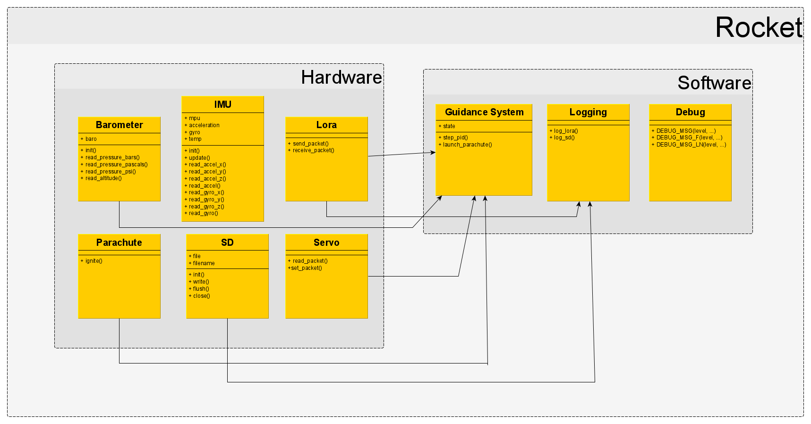

# ENGR 301 Project Architectural Design and Proof-of-Concept

[[_TOC_]]

**Authors:** Billy Rob, Finlay Sargisson, Niels Clayton, Ron Crisostomo,
Will Fowler, Zac Scott

## 1. Introduction

For rockets ranging from NASAs Saturn V to an amateur rocket enthusiasts
first rocket, stability is a desirable. The method in which stable
flight is achieved varies to a large degree, but can be divided into two
basic categories. The most common being passively stabilized rockets.
These maintain a stable flight due to passive aerodynamic features, an
example being fins that give the rocket a stabilizing rotation (similar
to the effect of rifling on a bullet). The simplicity of a passive
system is appealing but any error introduced to the system can cause an
unwanted flight trajectory. Some examples of sources of error include,
unexpected wind or a fin of differing size that is not accounted for.
The second category is an active control system. Onboard electronics can
be used to achieve active course correction. Error in the rockets
trajectory can be mitigated in a way that passive systems cannot. The
drawbacks of this are the complexity and large overhead introduced when
constructing the rocket.

Our customer is one day hoping to launch a rocket from a weather balloon
at approximately 70,000ft. This will require an active control system.
This project aims to covering the need for an active control system.
Existing off-the-shelf avionics packages for amateur rocketry
enthusiasts are available, but our customer finds them lacking. This is
due to limited functionality and with most packages not open source, so
they cannot be reprogrammed. This project aims to improve on an existing
attempt at this control system, completed in 2018, and is working along
side other teams to ensure all aspects are covered.

### Introduction Client

Our client for this project is Andre Geldenhuis. Andre is a rocket
enthusiast who is part of the NZ Rocketry Association. As of writing
this, the contact email is "andre.geldenhuis@vuw.ac.nz" and throughout
the project, the team can also contact Andre via a live text chat
(Mattermost) channel.

### 1.1 Purpose

The purpose of this system is to control a rocket in flight while being
opensource and accessible so that it can be used in the amateur rocketry
community.

### 1.2 Scope

The objective is to deliver an avionics system that will allow stable
controlled flight while simultaneously logging and broadcasting data.
This system must improve on the existing avionics package created by a
team in 2018 for Andre. There is no requirement on height or flight
time, only to demonstrate controlled flight. The flight data must be
logged to an onboard SD card, and the broadcast data must be accesed
realtime by a onsite personal computer. The broadcast data must include
the GPS position of the rocket. The rocket will use C or D class solid
fuel engines. The improvements on the 2018 avionics package are the
reduction in onboard PCB size, and reliability in the field. To be
considered more reliable the avionics package will have to initialize
and launch on the first attempt, the package must also not have loose
wires or bare electronics.

### 1.3 Changes to requirements

If the requirement have changed significantly since the requirements
document, outline the changes here. Changes must be justified and
supported by evidences, i.e., they must be substantiated. (max one page,
only if required)

---

## 2. References

\[1] P. Kruchten, Architectural Blueprints—The “4+1” View Model of Software Architecture, 12th ed. IEEE Software, 1995. [Online] Available: https://www.cs.ubc.ca/~gregor/teaching/papers/4+1view-architecture.pdf. [Accessed: 27- May- 2020]

\[2] Aviation.govt.nz, 2020. [Online]. Available: https://www.aviation.govt.nz/assets/rules/consolidations/Part_101_Consolidation.pdf. [Accessed: 12- Jun- 2020].

---

## 3. Architecture

### 3.1 Stakeholders

#### Client

- Avionics package must maintain the same functionality as was required
  last year:

  - Implement some form of control system, guiding the rocket
  - Interface with and control a gimbal
  - Log all flight data and calculations for later analysis
  - Communicate with the base station, relaying real time flight data
  - All code and schematics will be completely open source

- Designed PCB should be accessible to the wider rocket building
  community:

  - Easy to order from sites such as JLC-PCB
  - Parts will be accessible within New Zealand
  - Software will be easy to flash to the BCP, and will be well
    documented

- Designed PCB must be smaller than the previous years attempt

#### Software developers / Testers

- The avionics package development environment will allow for easy
  deployment of software to the package hardware
- The avionics package development environment will allow for feedback
  from the avionics package, used to monitor performance of the package
  while in use.
- The avionics package will consist of a series of modules, each with
  defined responsibilities.

#### School of Engineering and Computer Science (ECS)

- ECS requires that all aspects of the avionics package are correctly
  licenced
- ECS requires that we follow all guidelines specified by them

#### Wider Rocketry Community

- The avionics package is required to be open source so that it can be
  implemented and edited by the wider rocketry community. -The avionics
  package is required to be well documented.

#### Civil Aviation Authority

- The avionics package must conform to the regulations specified in the
  CAA Regulations Part 101 \[2]

### 3.2 Architectural Viewpoints

#### Logical

The logical viewpoint will describe the functionality that the system
provides to the end user. This viewpoint will break the system down into
its key concepts, this can be visualised as a class and state diagram.

#### Development

The development viewpoint will describe the architecture that supports
the processes involved in the software development cycle, and aims to
address concerns regarding the management of the software.

#### Process

The process viewpoint will describe the dynamic and non-functional
requirements of the system. _TODO I currently dont know what we should
put here as it dosent seem to fit with the hardware aspect of our
project_

#### Physical

The physical viewpoint details how the software will integrate with the
hardware, mapping individual packages within the avionics package to
their respective hardware. This viewpoint will discuss the availability,
reliability, and performance of both the hardware and software system.

#### Scenarios

The scenarios viewpoint will detail use cases that describe the
interactions between users and the system. This will then allow for
qualitative reviews of our given architecture.

---

### 4. Architectural Views

### 4.1 Logical

**Overview**: The logical view is concerned with the functionality that
the system provides to the end-users from a heavily software oriented
perspective. This encapsulates different characteristics and
responsibilities of the system such as those concerned with the systems
computation, communication and heuristic.

To help represent this, UML diagrams will be used to represent the
logical view, including both state and class diagrams. By reading these diagrams, the reader should have a reasonable level of understanding of the basic design and structure of the system. This representation will only provide a rough overview, and to reduce noise, individual implementations will be omitted.

**Class Diagrams**: The class diagrams will contain nodes that represent components within the system. For all leaf nodes (no sub-modules) within the class diagram, there will be internal attributes that map characteristics of the respective components.

We've decided to split our codebase into two separate libraries: hardware and software. By modularizing our code like this we are able to keep our code as flexible as possible. This is important for accommodating future iterations and extensions of this project.

**Hardware:**  
The code in the hardware library is very specific to the components used for this project. For example, the code in imu.cpp is based off of our IMU; the MPU-6050. Each of these files will likely need to be replaced or tweaked if the relative part is changed out. The key goal for this library is to provide an API for interacting with each of the hardware components.

**Software:**  
The code in the software library is independent of the hardware, and should be able to work for the most part regardless of the specific parts used. This is possible due to the software library exclusively interfacing with hardware through the hardware package method calls, so there is no need to know about the internal workings of any of the hardware methods or processes. This package is mainly about the actual logic of the rocket and the process it takes, so will keep track of more abstract things such as the rocket state and logging. In theory, this package should be quite robust to future iterations of the project.

**_Figure 1:_** UML Class Diagram of Software Module Organization

**State Diagrams**: To represent the different states and modes that the
rocket may be in, a state diagram will be used. This diagram will follow
traditional state chart diagrams. Namely, different states will be
represented within a rounded oblong. Arrows will point between different
nodes to indicate transitions. These arrow will contain any relevant
trigger / action that causes the change in state. These will be in the
form of text.

To indicate the starting state of the system, a solid black circle will
be used. To indicate the end state of the system a solid black circle
with an outer black ring around it will be used.

A full list of the other available ruleset for the project can be found
at the following link:

[https://www.uml-diagrams.org/state-machine-diagrams.html](https://www.uml-diagrams.org/state-machine-diagrams.html)

**_Figure 2:_** UML State Diagram of Rocket

In the specific case of the project, Figure 2 describes the specific
states the rocket can take during its life, and the actions/events that
need to occur to transition between them. Its also important to
note that the system follows a linear progression in states, with each
state performing specific actions that contributes to trigger a
transition to the next state.

Given the safety-critical nature of the project, there are many points in
the diagram that terminates the life of the rocket before being given the
opportunity to transition through all states successfully. For example,
the progression through states is ended prematurely in the
'Software Interlocks Active' state if the mission control software
sends a 'Cancel Launch' signal, indicating that environmental launch
requirements were not met. The existence of premature termination in the
system is crucial in order to comply with the health and safety
regulations the project must adhere to.

### 4.2 Development

The development architectural viewpoint centers around the static
organization of the software system that needs to be developed, and
specifying the set of practices to be applied in the development of the
software \[1]. This viewpoint targets the project stakeholders that are
involved with the development of the software.

#### 4.2.1 Software Module Organization

**Figure 3:** UML Component Diagram of Software Module Organization

Figure 1 describes the target software structure at an abstract level in
the form of a UML component diagram. The diagram conveys the presence of
2 central high-level components, Hardware, and Software. In addition to
this, there is a Main component to intialize the system, and a third
component 'Hardware Interfacing Libraries' (HILs) which refers to the
external libraries that allow the Hardware component to obtain
information from the physical hardware onboard the rocket.

##### Hardware Package

The Hardware component of the application comprises of 7 different
sub-modules that directly corresponds to a piece of hardware onboard the
rocket (Barometer, IMU, Servos, Radio, Battery, Parachute and SD). Each
module serves the purpose of abstracting the ability of the entire
software system to obtain readings from the HILs for its corresponding
hardware (e.g if a submodule in the Software component nexwds to read
from the physical hardware, it should make a call to the intended
submodule in the Hardware component instead of directly interfacing with
the HILs component). It is important to note that each submodule is
decoupled from each other to reinforce the maintainability and
extensibility of the Hardware component.

##### Software Package

The Software component of the architecture contains submodules that
solely rely on software-only processing. In this project, there are 2
major aspects that are reliant on software-only processing, the Guidance
System of the rocket (hence the Guidance System submodule) and the
Logging system of the rocket (hence the Logger submodule). This
component requires the usage of the Hardware component as the submodules
the Software component contains will require the readings given by the
Hardware component (which the Hardware component will obtain from the
HILs).

##### Main and HILs

The Main component is responsible for intializing the system (making use
of the Hardware and Software components in order to do this) and
maintaining the process loop that continues while the rocket is deemed
active. The HILs are a collection of external open source libraries that
enables the developers of the projects to interface with the physical
hardware.

##### Modularity, Reliability and the Layered Architecture

In section 3.7 of the requirements document, it has been outlined that
maintainability and extensibility of the software is a desired
non-functional requirement to make it easy for future individuals to
contribute to the project. To work towards this objective, it is
important that the organization of the software system accomodates for
the idea of modularity. Steps were taken to minimize the number of
dependencies that need to exist between the components, as well as the
dependencies between the submodules contained in each component. This is
seen in Figure 1, where there are no client-service relationships
between any of the submodules to ensure that each submodule can operate
as an independent unit of software. Figure 1 also depicts a 3 layer
architecture with 1 way dependencies (Software depends on Hardware and
Hardware depends on HILs), with the Main component cross cutting between
the layers. This is an essential aspect of the architecture as it
creates a strict separation of duties, resulting in a high level of
cohesion at each layer. Furthermore, the 1 way dependencies assist in
minimizing the propagation of errors that occur within each component.
For example, if an error occurs in the Software component, the Hardware
and HILs components should remain unaffected and continue working as
expected since neither of these components needs a service provided by
the Software component. On the contrary however, an error occuring at
the higher layers (i.e Hardware and HILs components) will result in the
failure of components that use services provided by these higher layers.

#### 4.2.2 Development Environment and Practices

##### Gitlab Workflow

Git and GitLab are used in conjunction for the version control aspect of
the project. The benefits of a platform such as GitLab is that in
addition to version control, it provides a platform for project
management and CI/CD.

- **Project Managing through GitLab**

  GitLab gives the ability to break down projects into well defined
  pieces in the form of **epics, sub-epics, milestones, and issues**. In
  the context of this project, the project team decided that each of
  these components corresponds to the following:

  - **Epics** - Represents a phase in the project.
  - **Sub-epics** (An epic assigned as a child epic to another epic) -
    Represents a feature or user story relevant to the corresponding
    parent epic (Project Phase)
  - **Issues** - Specific, narrowly-scoped objectives that contribute to
    achieving its assigned subepic. Subepics should be associated with a
    collection of issues. Issues are assigned to 1 or more team members
    on a voluntary basis (as per the Scrum principles).
  - **Milestones** - Represents an iteration/sprint within a project.
    Each milestone will be assigned a start date, and a due date 2 weeks
    from the starting date. In each milestone, At least 1 sub-epic will
    be addressed, which in turn will address a range of issues. Each
    milestone will be assigned a board through GitLab. The board serves
    as a visual representation of the tasks that need to be undertaken
    for a sprint, and their current status (eg Open, To Do, Doing,
    Review, Closed)

- **Branching Strategy and Merge Requests**

  The branching strategy adopted by the team involves the creation of a
  branch and merge request for every issue a team member decides to do.
  **The branch created must be branching off the master branch.** If
  more than 1 team member is assigned to an issue, those team members
  can decide if they want to create further individual branches that
  branch off the newly created branch.

  

  Figure 2: Branching Strategy Diagram

  The diagram in figure 2 follows a small example of only 3 issues being
  addressed in the sprint. Each issue has a branch and should be
  composed of multiple commits as represented by multiple nodes of the
  same color in the diagram. When the issue has been completed, the
  branch should be merged into the master branch via the merge request.
  After merging, the branch created for the issue will be closed, so
  should the corresponding issue.

- **Completing an Issue and Merge Request**

  When the issue has been completed, it is the responsibility of the
  issue assignee to move the issue to the **review stage** via the
  sprint board, and assigning the issue the 'review' label. The merge
  request should be assigned the review label to indicate to other team
  members that the merge request is ready for reviewing. Relevant team
  members will be responsible for inspecting the changes applied through
  the merge request, and will have to provide an approval. Once the
  review stage has been completed, issues should then be automatically
  closed via Merge Requests. This is done by commenting "Fixes
  \#Issue-Number" (eg. "Fixes #2"). this will link the issue to this
  merge request, so that upon merge these issues will be automatically
  closed. **Each merge request must receive a certain number of
  approvals** before being able to merge its contents with the master
  branch. It is the responsibility of the team members to provide
  feedback and suggestions to the merge request as they see fit. After
  receiving the required number of approvals, the merge request can be
  completed by merging its corresponding branch to master and closing
  the merge request. The source branch has the option to be closed with
  the merge request, however it is up to individual team members to make
  use of this feature.

- **Continuous Integration**

  Continuous Integration is the idea of automating a pre-defined set of
  actions on the project repository after work is pushed to the remote
  repository. This enables the development team to closely monitor the
  state of the repository and identify issues within the project from a
  project maangement perspective, as well as from a technical
  perspective.

  The CI/CD pipeline is configured through the `.gitlab-ci.yml` file at
  the root of the project repository. This file defines the actions
  taken on the repository when work is committed. For this project, the
  pipeline is configured to do the following:

  - Linting - Source code and markdown files in the repository are
    validated against selected linting software. (see Linting section
    below for more information)

  - PlatfromIO Building - All source code in the repository is built
    through the PlatformIO platform. This ensures that the source code is
    always in a valid state as it appears on the repository.

  - Testing

    - Source code and output files of KiCad are tested to verify their
      correctness.
    - Code coverage generation is automated to aid developers in
      determining what parts of the source code has been tested

  For technical details of the project's CI/CD implementation, refer to
  the
  [`.gitlab-ci.yml`](https://gitlab.ecs.vuw.ac.nz/course-work/engr300/2020/group3/group-3/-/blob/master/.gitlab-ci.yml)
  file for more details.

##### Agile Project Management

The project will be managed by observing agile project management
principles. In particular, the Scrum agile project management
methodology is used as a template on how to conduct the project. The
project is conducted in **2-week sprints**, with each sprint addressing
at least 1 epic defined for the project. Sprint planning meetings will
be conducted to obtain a sprint backlog, and to officially initiate the
sprint. Brief sprint reviews will be conducted at the end of sprints to
give the project team some insight on how the sprint progressed, and
what could be improved. The usage of issue boards and limiting the
number of tasks that can be in a single phase are inspired from the
Kanban methodology of agile project management. This assists the project
team in determining the status of issues, and finding out what still
needs to be addressed. Regular meetings are also conducted to monitor
and encourage the progress of each individual towards the issues they
are assigned to. By observing these ideas, team members are able to
collaborate effectively, enabling the project the reach its goals in a
systematic fashion.

##### Coding Conventions

Due to the safety-critical nature of the product being developed, it is
imperative that the software system is written in a way that assures
reliability, security and safety. To achieve this, the software is
written in accordance with the "Power Of 10" which is a widely used
ruleset for writing safety-critical software \[3].

###### Power of 10 - All these rules are adhered to in the development ofthe software

1. Avoid complex flow constructs, such as "goto" and recursion.
2. All loops must have fixed bounds (this prevents runaway code).
3. Avoid heap memory allocation.
4. Restrict functions to a single printed page.
5. Use a minimum of two runtime assertions per function.
6. Restrict the scope of data to the smallest possible.
7. Check the return value of all non void functions, or cast to void to
   indicate the return value is useless.
8. Use the preprocessor sparingly.
9. Limit pointer use to a single dereference, and do not use function
   pointers.
10. Compile with all possible warnings active; all warnings should then
    be addressed before the release of the software.

###### Style Guide

- To accompany the coding standard to laid out above, there will also be
  a C++ style guide. For this project, the
  [Google C++ Style Guide](https://google.github.io/styleguide/cppguide.html)
  is used.
- This style guide specifies rules to be followed such as variable,
  struct and file naming conventions.
- To accompany this style guide, a C++ linter will also be configured to
  check for any violations in Continuous Integration (CI). The linter
  chosen is [cpplint](https://github.com/cpplint/cpplint) as it is fully
  open source and pre-configured to comply with the aforementioned
  Google Style guide.

###### Debugging

Debugging mission critical software can be a tiring concern. As software
executes on the rocket's micro-controller instead of on the developers
PC. This can mean debugging can be limited. One of the mechanisms
developers can use to help check the rockets' software is performing
correctly is writing log files or printing to the serial console.
Although log files are great for retrospectively investigating the
software's behaviour it would be insufficient to utilise for general
development testing. To support this, we have introduced a debug flag
and method that can help manage all of these debug messages. This flag
can be passed to the software as a build argument, and will default to
`0` (OFF) by default. This flag can be set using GCC's `-D` flag and is
set within the `platformio.ini` platformio project configuration file.
The following debug scale is as specified below:

| DEBUG | Description                               | Example                                                 |
| :---- | :---------------------------------------- | :------------------------------------------------------ |
| 0     | No debug whatsoever.                      | N/A                                                     |
| 1     | Debugging (light messages, no specifics). | Eg. `TODO implement this...` and `parachute launched.`. |
| 2     | Full verbose (remainder of information).  | Eg. `Returned value 5` or `Entering loop iteration 2`.  |

###### Linting

The Gitlab repository will use multiple linters to enforce that all
documents are syntactically correct, consistent, safe, and readable. By
conforming to these conventions, future users are given the ability to
contribute to the software system much easier, given that they can
understand the conventions followed.

The linter used is [cpplint](https://github.com/cpplint/cpplint). This
open source C/C++ linter will be integrated as part of the CI component
of the project's GitLab repository to enforce the Google C++ Style
Guide. Being a command-line tool, this linter is ideal for deployment on
the CI system of GitLab.

For the markdown documents in the project, the linter being used is
[markdownlint-cli](https://github.com/igorshubovych/markdownlint-cli).
Like cpplint, this is also a command-line focused tool, making it an
ideal tool for integration within GitLab's CI system. This linter will
enforce a set of predefined markdown formatting rules specified
[here](https://github.com/DavidAnson/markdownlint/blob/main/doc/Rules.md).

###### PlatformIO

The software development component of the project is facilitated by
[PlatformIO](https://platformio.org/). PlatformIO is development
platform focused around software development for embedded systems. Given
the mix of hardware and software development this project features,
PlatformIO is the ideal development platform to streamline the
development of the project.

The software system is enclosed within a PlatformIO project. All building
and compilation of source code is facilitated by PlatformIO
(via `pio run`), as well as the execution of unit tests (via `pio test`).
The project also makes use of PlatformIO events which enables the creation
of distinct development environments within a single project. From a
development perspective, this means that developers are able to create
different environments, each with their own characteristics (e.g
differing compilation options, libraries) in a way that accomodates for
a wide range of settings and applications.

In the specific case of this project, there are 2 important environments

- Adafruit Environment - This is the environment used by the on-board
  microcontroller. This environment contains all the adafruit libraries
  required for the source code to operate correctly.

- Native Environment - This is the environment used by any machine that
  is not the microcontroller. This environment is applicable only to host
  machines that are incapable of obtaining the adafruit libraries.

For further details on how PlatformIO is used in the project, refer to
the [`development`](../software_package/development) directory
to see a live example.

##### Unit Testing and Code Coverage

Unit testing is facilitated directly by PlatformIO through the
[PlatformIO Unit Testing](https://docs.platformio.org/en/latest/plus/unit-testing.html)
framework. Internally, this framework utilizes
[Unity](https://github.com/ThrowTheSwitch/Unity), a C/C++ Unit Testing
API. The incorporation of this framework within PlatformIO makes it the
ideal unit testing framework for this project. Using PlatformIO allows
for us to perform unit tests on both our personal machines and on the
hardware. This is extremely important for allowing us to continue
development from a remote stand point.

Each of the packages in our source code library will have a dedicated
package related to it inside of the test package. This modularization of
the unit tests allows for us to better locate any weak points in our
codebase, as we are able to perform diagnostics, eg. code coverage, on
each specific package.

Generating code coverage reports is not currently a feature of
PlatformIO. As a result, the project generates code coverage reports
using written shell scripts, as well as the usage of
[gcov](https://gcc.gnu.org/onlinedocs/gcc/Gcov.html) and
[gcovr](https://gcc.gnu.org/onlinedocs/gcc/Gcov.html). gcov Is a code
coverage tool that comes packed with gcc/g++ to enable the generation of
code-coverage related metadata. This tool works in tandem with gcovr to
use the generated metadata to create a visual representation of
software's code coverage. Technical details of the project's code
coverage implementation can be viewed
[here](https://gitlab.ecs.vuw.ac.nz/course-work/engr300/2020/group3/group-3/-/tree/master/software_package/code_coverage).

Both of these factors directly contribute to the project team's effort
to fulfill the verification requirements of the project, as stated in
[section 4](https://gitlab.ecs.vuw.ac.nz/course-work/engr300/2020/group3/group-3/-/blob/master/project_requirement/project-requirement.md#4-verification)
of the Project Requirements document. In addition to this, both unit
testing and code coverage generation is implemented as part of the
project's CI implementation.

### 4.3 Process

The Process view aims to visually explain and represent the interaction
and communication between the different system processes during the run
time of this package. Below is a high level UML Activity Diagram which
showcases the control flow and different states.

#### 4.3.1 Concerns

##### Concurrency

One key consideration around the system is the choice for concurrency
when reading and writing data from the sensors. When data is read from
the sensors there are two tasks which must be completed: sending the
data over radio to mission control, and using this data to update the
position of the rocket. While it is important for the rocket to
communicate via radio with the base station, the flight controller
should not be dependent on the success of this. Without these tasks
running parallel if it were unable to send data to the base station then
it would also be unable to update the position of the rocket, putting
the rocket in a failure state while it is in flight. This is something
which would just not be acceptable. As this data is important for post
flight analysis it will still be stored, which means any data
potentially lost with a communication error can be recovered once the
rocket has left the flight stage and its less of a risk.

##### Accuracy of data sent via radio

One of the concerns that comes with concurrency is that the speed at
which positions are being read and updated may be faster than the speed
at which this data is sent via radio. This opens up the issue of
position data being overwritten before it has been sent. To avoid this
the data is stored first with the help of the Logging package. This
allows for the data to be sent at both slower speeds, as well as after
the flight is complete.

##### State Management

The current state of the system will be managed via the Control Package.
The Radio Interface will be used for initialisation, which will
communicate with the control package for running pre-flight diagnostic.
The Guidance System sub-package will be in control for the flight phase,
with the Landing sub-package taking control post flight.

As is common with flow control, almost all of the activities in this
diagram are dependent on the successful completion of the prior
activities. This logic must also be reflected in the code. The
activities have a strong association with the different states of the
rocket. The current state will be stored and managed via the Control
package to ensure that this flow is stuck to throughout run time.

##### Error Propagation

Error Propagation is a key concern when managing the control flow of the
system. Its crucial that errors don't get passed down from action to
action, as it can become impossible to tell where the fault initially
occurred. For example, if there's an error in the initialisation of the
components then we don't want the launch sequence to be able to continue
with this error. All errors need to be isolated and either corrected, or
put the system in a failure state. This isolation approach has been
implemented via the guards (eg. \[Initialised]) and decision nodes of
the UML activity diagram, which aim to catch any errors in the higher
risk activities.

### 4.4 Physical

This viewpoint extends to the physical hardware that the system will be
implemented on. For the avionics package the view of the physical system
includes two major blocks, the rocket and the base station. Interaction
between these two systems is fairly limited as the rocket's operation is
intended to be autonomous during flight. However, radio communication still
occurs throughout operation. Pre-flight, the system status of the rocket
must be verified before the launch sequence is initiated.
During flight, telemetry is broadcasted and received by the base
station, this is to ensure that in the event the rocket is not
recovered, flight data can still be reviewed. Post-flight, the base
station is able to query the location of the rocket should its location
be unknown after landing. During operation the rocket's functions are to
take measurements from on-board sensors, actively control flight through
the gimbal and store as well as broadcast data pertaining to sensor
measurements. The Base Station actively monitors
the radio channel and stores the received telemetry data into a local
database.

In terms of scalability, the physical hardware could be improved in a
few aspects. The onboard STM32F405 could be upgraded, or hardware acceleration components could be included to support greater data logging resolution. There could be more
than one base station/and or antennas communicating with the rocket to ensure a more
stable connection. The flight data could also be stored across more than
one SD card or hard drive in the event that one or more of the drives is
corrupted or damaged.

#### 4.4.1 Circuit

The circuit architecture
viewpoint details the physical components of the avionics package and
how these connect on the printed circuit board (PCB).

The main components included on the PCB are listed:

- STM32F405 microcontroller
- MPU-6050 IMU
- RFM69HCW radio module
- MPL3115A2 Barometer
- Micro SD reader/writer
- USB-C recepticle
- Battery

The connections on the PCB fall into two categories, those transfering data and those providing power.
Beginning with the power, the board is connected to a 2-cell LiPo battery which outputs a voltage between 8.4-6V depending on charge. As the STM32F405 requires half of this voltage it is first regulated down to 3.7V (nominal voltage of an individual cell). This is then fed into a second 3.3V regulator which is enabled only when the board is not connected to USB-C. The 3.3V DC is then connected to the microcontroller, microSD port, radio module, IMU, Flash memory, barometer and GPS. To improve the robustness of the design against EMI and under voltage issues, an array of capacitors are connected in parallel to the 3.3V rail. The ground for all components is referenced to the negative terminal of the battery. As the JST connector on the LiPo battery is keyed it is not necessary to add reverse polarity protection, however, a polyfuse is included to provide protection against over current in the event of a short circuit.

In terms of data, the sensors and peripherls on the board communicate with the microcontroller via I2C and SPI interfaces. The barometer, GPS and IMU all make use of I2C, while the radio module uses SPI. The USB-C and microSD ports both use their respective protocols to transfer data to and from external hardware.

For development, the circuit incorporates several test points and LEDs
to aid in quickly identifying the status of the system as well and
troubleshooting any issues. The microcontroller also offers additional
ports for any extra peripherals required. This may include additional
sensors or devices involved in the active control of the rocket. This
may include wiring to a remote charge for ejecting a parachute for
example.

#### 4.4.2 Hardware

The hardware architecture is specifically related to the interaction
between software and the hardware systems onboard the rocket. The
purpose of this viewpoint it to address the main concerns within the
hardware system to software relations that are held by the stakeholders.
An intention of this viewpoint is to assist users in integrating their
own hardware or software designs into the hardware aspects of the
product while being aware of where these major concerns lie. A mapping
of dependencies between hardware and systems is shown below.

The arrow directions points to the component that relies on the system where the
arrow originates from. The red arrows indicate power dependency, whereas the green arrows indicate data transfer. This
diagram can be used to see dependencies between the software and
hardware systems within the rocket. This diagram omits the base station
receiver.

One or more of the project aims will not be achieved if any of the
concerns below are not met by the system. Therefore, when integrating
any new hardware or software systems into this system, the following
concerns must be addressed.

##### Power system

The power system is the most important system within the rocket. All
Hardware components (excluding non-electrical components) will not
function if this system malfunctions. There are several concerns
regarding the power supply. Each component added to this system, similarly to
the existing components, need to be connected to the correct voltage
rail. The existing lines are 7.4V and 3.7V. The voltage and max current must be abided by, otherwise
the power supply may shut off or fail. If these are not sufficient for
the new hardware a new voltage rail must be added. A concern regarding new voltage lines is the portion of the total battery current it
will draw. This must not exceed 22.5A and must still allow enough for the
required current draw on the other lines, otherwise other components will
malfunction.

###### Communications and Storage systems

A requirement is that data must be saved and transferred to the base station.
All saved and transmitted data is processed in the microcontroller where
it is packaged. The packaged data is from the IMU, GPS and Barometer. The software on the microcontroller is what
polls the sensors. A failure in the sensors will
be handled by the software and data may still be sent to the basestation. However, if the microcontroller, antenna, or the signal
amplifier fails, the communications requirement will not be met. In addition to radio, there
is hardware to interface with a microSD card for onboard storage of data,
if this fails, data will not be saved onboard and may cause a halt on
the microcontroller causing the system to fail.

The rocket acceleration will not allow some components to work properly.
The onboard GPS is not accurate for the acceleration phase
of the rocket's flight. This must be noted when adding new hardware and
software system. new software should not rely on the GPS during the
acceleration phase. Caution should be employed when adding new hardware,
that is intended to be used during acceleration phase as the
acceleration may effect functionality.

###### Control system

The microcontroller is at the center of the Control System, it contains
the software that polls the IMU and outputs the gimbal motor
voltage signals to adjust the flight path. All components in this chain
are required for this process, including the software. If any of these fail,
controlled flight will not happen.

###### Ignition system

The ignition system requires a large current for a short duration to ignite the charge. This has to remain isolated from the power system as not to damage
the components within. This works by charging a large capacitor and using a mosfet to quickly discharge it through the ignition charges when toggled by the microcontroller.

###### Base Station

Key data is sent to the base station, the rest is stored on the rocket
to save the computing resource available. Sent data includes the Battery
level, GPS position (For locating after the acceleration phase), as well as the output from the control system.

###### Software

The microcontroller's onboard flash memory is where the control system
parameters are stored along with the program code, and the device drivers. The software is responsible for writing data to the LoRa module and SD card as well as polling data from the IMU, barometer and GPS.

### 4.5 Scenarios

Throughout our development we are aiming to tackle a couple of scenarios
(or user stories) for each sprint. These will assist us in developing
specific extensions, features, and functionalities within our package,
while keeping a focus on our user's needs. This is met by following the
general template: "As a \[type of user / persona], I want \[feature], so
that \[achievement/justification]".

We aim to use scenarios to cover interactions between our package and
both personas and user types. Each of our personas can be found in depth
inside the /personas/ directory. The user types is for representing a
specific group of potential users, eg. a 'Mission Control Member'.

There is a slight exception to our approach to scenarios within the
first two sprints, where we are placing a higher priority on just
achieving a base product. Due to the extension based nature of scenarios
we felt that the majority of the uses cases required us to have our
project up to a certain level.

#### 4.5.1 Sprint Specific Scenarios

##### Sprint 1

We didn't cover any scenarios here as we instead prioritised progress on
the Architecture Document as well as starting to plan out the base
product.

##### Sprint 2

This was our first sprint where we even considered use cases. Again we
had a higher priority on getting our project up to speed, and as such
the only scenario we truly aimed to address was:

- As Richard, I want to be able to easily read and understand all of the
  code, so that I am able to understand and contribute to it myself.

This involved us cementing both coding styles and practices which we
shall use throughout development of this project. Keeping this
consistent means that users and future users should have as simple a
time as possible reading through and understanding the code.

#### 4.5.2 Future Scenarios

Below is a list of scenarios currently divided into different
categories, which we aim to cover in future sprints. This list is by no
means definite, and is likely to be expanded on throughout development.

##### Base Station Setup

- As a novice user, I want the ability to setup the base station
  software quickly, so that the overall setup time to launch the rocket
  is less than or equal to 15 minutes.

- As a base station member, I want the ability to run diagnostic tests
  on the rocket before launch.

##### Pre-Flight Tuning of PID parameters

- As a novice user, I want the ability to make changes to the parameters
  of the PID, so that the rocket can fly correctly under a wide range of
  conditions.

###### Mid-Flight monitoring

- As a user of the base station, I want the ability to see data about
  the rocket during its flight, so that I can find out whether or not
  the rocket is performing as expected.

###### Post-Flight Analysis

- As a novice user, I want the ability to review the data after the
  flight of the rocket, so that I can examine the performance of the
  rocket in finer detail.

- As a hardware enthusiast, I want the ability to deconstruct the rocket
  easily, so that I can examine the state of each individual hardware
  component after the flight and make changes if needed.

##### Safety

- As a \[safety conscious user] I want my launch system to be safe, so
  that I can ensure that the rocket will not launch until I have
  physically told it to.

###### Recovery

- As Richard, I want to use GPS data to give me the position of the
  rocket's landing site, so that I can locate the rocket easily after
  its flight

- As Molly, I want the rocket to land with a parachute safely, so that
  the rocket can be used for more flights.

###### Launch

- As a rocket enthusiast, I want the rocket to be contained within a
  single kit, so that it can be constructed and ready to launch within
  15 minutes

- As a rocket enthusiast, I want the launch-critical components of the
  rocket to be clearly labeled, so that I know exactly what components
  of the rocket need activation to be launched

- As a rocket enthusiast, I need the rocket to feature manual ignition
  with physical safety interlocks, so that I can launch it from a safe
  distance.

- As a novice user, I want the hardware to be robust against incorrect
  installation procedure of the motor and battery, so that components
  aren't accidentally damaged.

##### Landing

- As a rocket enthusiast I want to have support for both smaller and
  larger parachutes, so that the rocket can handle launches from extreme
  heights. (further iterations)

###### Transportation

- As a novice user, I want the rocket to be light, so that I can bring
  it anywhere with ease.

- As a novice user, I want the rocket to be contained within a single
  kit, so that I can bring it anywhere easily without the potential of
  losing important parts.

---

## 5. Development Schedule

> _For each subsection, make clear what (if anything) has changed from
> the requirements document._
>
> If unchanged, these sections should be copied over from the
> requirements document, not simply cross-referenced.
>
> Schedules must be justified and supported by evidences; they must be
> either direct client requirements or direct consequences of client
> requirements. If the requirements document did not contain
> justifications or supporting evidences, then both must be provided
> here.

### 5.1 Schedule

Identify dates for key project deliverables:

#### Demos

- **TODO DATE** - This demo will enable the software team to ensure that
  software is logged correctly.
- **TODO DATE** - This demo will be used to verify safety critical
  components of the rocket such as ensure the parachute launches as
  expected.
- **TODO DATE** - This demo will be used to ensure communication with
  the rocket over LoRa performs as expected. In this demo, we will be
  testing how far we can reliably communicate with the rocket.
- **TODO DATE** - This demo will be testing usability and introduce a
  prospective user with the rocket. The rocket will be defused before
  the demo and is strictly to observer user behaviour.

#### Releases

- Architectural Prototypes
  - The architectural prototype will be completed my **TODO**.
- Minimum Viable Product
  - The minimum viable product will be completed by **TODO**.
- Final Revision
  - The final revision will be completed by **TODO**.

(1 page).

### 5.2 Budget and Procurement

#### 5.2.1 Budget

Present a budget for the project (as a table), showing the amount of
expenditure the project requires and the date(s) on which it will be
incurred. Substantiate each budget item by reference to fulfilment of
project goals (one paragraph per item).

| COMPONENT        | COST            | NAME/DESCRIPTION/LINK                                                                                                                                                                                                                                                                                                                                                                                                                                        | REASONS FOR CHOICE                                                                                                        |
| :--------------- | :-------------- | :----------------------------------------------------------------------------------------------------------------------------------------------------------------------------------------------------------------------------------------------------------------------------------------------------------------------------------------------------------------------------------------------------------------------------------------------------------- | :------------------------------------------------------------------------------------------------------------------------ |
| Micro-Controller | \$24.95 USD     | Adafruit Feather STM32F405 (168MHz) [BUY](https://www.adafruit.com/product/4382), [Github](https://github.com/adafruit/Adafruit-Feather-STM32F405-Express-PCB), [Documentation](https://www.digikey.co.nz/en/videos/a/adafruit/programming-the-adafruit-feather-stm32f405-express-with-stm32cubeide-maker-io)                                                                                                                                                | Small, Light, Good Opensource Libraries & Good Documentation                                                              |
| IMU              | \$17.59 NZD     | BNO055 [BUY](https://nz.mouser.com/ProductDetail/Bosch-Sensortec/BNO055?qs=QhAb4EtQfbV8Z2YmISucWw%3D%3D), [Datasheet](https://nz.mouser.com/datasheet/2/783/BST-BNO055-DS000-1509603.pdf), [Adafruit library](https://learn.adafruit.com/adafruit-bno055-absolute-orientation-sensor/arduino-code)                                                                                                                                                           | Good Libraries, quaternions, Better Documentation                                                                         |
| GPS              | \$61.93 NZD     | Adafruit Mini GPS PA1010D [BUY](https://www.digikey.co.nz/products/en?keywords=PA1010D), [Datasheet](https://cdn.taoglas.com/datasheets/GP.1575.25.4.A.02.pdf)                                                                                                                                                                                                                                                                                               | Cheap, Small and Meets requirments                                                                                        |
| Transceivers     | \$19.95 USD     | Adafruit RFM96W LoRa Radio Transceiver Breakout - 433 MHz - RadioFruit [BUY](https://www.adafruit.com/product/3073), [Overview](https://learn.adafruit.com/adafruit-rfm69hcw-and-rfm96-rfm95-rfm98-lora-packet-padio-breakouts?fbclid=IwAR35VbMkCNa8vlXsCGSQ_aMt7WncGXr0NET0dsGQH1ARlQAluhj9rdhM1OQ), [Datasheet](https://cdn-learn.adafruit.com/downloads/pdf/adafruit-rfm69hcw-and-rfm96-rfm95-rfm98-lora-packet-padio-breakouts.pdf?timestamp=1592280787) | SPI, Pins for extra antenna                                                                                               |
| Gimbal Servos    | \$6.97 NZD each | SERVOMOTOR RC 6V MICR METAL GEAR [BUY](https://www.digikey.com/product-detail/en/dfrobot/SER0011/1738-1232-ND/7087129?fbclid=IwAR3tHvFKb_L4hPvRHZ3XCM0uWsSMUwFsVYjAItaNuxh1T_yVfbpZaJRjYQQ)                                                                                                                                                                                                                                                                  | 15grams Small, Cheap, Has dimension specifications                                                                        |
| Battery          | \$12 NZD        | ZIPPY Compact 500mAh 2S 35C Lipo Pack [Buy](https://hobbyking.com/en_us/zippy-compact-500mah-2s-35c-lipo-pack.html?queryID=daa4b6898932867645b366984b5914b9&objectID=24762&indexName=hbk_live_magento_en_us_products)                                                                                                                                                                                                                                        | -Available in Australia, - Sufficient Charge, Voltage and Current discharge specifications, - Cheap, -Light for a battery |
| Power supply     | \$3.62 USD      | See power_supply.md                                                                                                                                                                                                                                                                                                                                                                                                                                          | See power_supply.md                                                                                                       |
| Total            | ~\$230 NZD      | -                                                                                                                                                                                                                                                                                                                                                                                                                                                            | -                                                                                                                         |

(1 page).

#### 5.2.2 Procurement

Present a table of goods or services that will be required to deliver
project goals and specify how they are to be procured (e.g. from the
School or from an external organization). These may be software
applications, libraries, training or other infrastructure, including
open source software. Justify and substantiate procurement with
reference to fulfilment of project goals, one paragraph per item. (1
page).

### 5.3 Risks

Please refer to section 5.3 of the
[requirements document](https://gitlab.ecs.vuw.ac.nz/course-work/engr300/2020/group3/group-3/-/blob/master/project_requirement/project-requirement.md)
for further information.

### 5.4 Health and Safety

Information regarding health and safety provided in section 5.4 of the
[requirements document](https://gitlab.ecs.vuw.ac.nz/course-work/engr300/2020/group3/group-3/-/blob/master/project_requirement/project-requirement.md).

#### 5.4.1 Safety Plans

Detailed safety plan regarding operation can be found here:
[safety plan](https://gitlab.ecs.vuw.ac.nz/course-work/engr300/2020/group3/group-3/-/blob/master/project_requirement/safety-plan-analysis.md)

---

## 6. Appendices

### 6.1 Assumptions and dependencies

- All hardware components used in the construction of the rocket are free
  of defects immediately after being delivered from the vendor.

- Microcontroller in use is more than capable of everything the software
  system requires it to do.

- Adafruit/Arduino libraries and will remain FOSS indefinitely.

- Adafruit/Arduino libraries are tested and reliable

### 6.2 Acronyms and abbreviations

CI/CD (Continuous Integration/Continunous Delivery): The software process
of merging version control branches into a single branch and conducting
software operations and workflow (i.e testing) in an automated fashion.

pio or PIO (PlatformIO): A development platform for embedded systems.

HILs (Hardware Interfacing Libraries): 3rd party libraries (usually
provided by Adafruit) that enable the software system of the project
to interact directly with the hardware.

FOSS (Free and Open Source Software): The concept of software and other
designs, components, constructed material etc. being transparently
available to the public at no additional cost.

---

## 7. Contributions

An one page statement of contributions, including a list of each member
of the group and what they contributed to this document.
