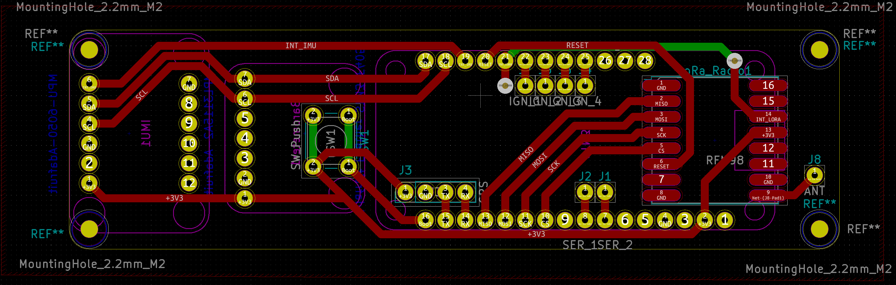
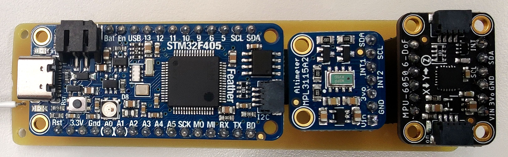

# Avionics Component Breakout PCB

This PCB is designed to interface the NodeMCU microcontroller with the RFM98 radio module. This board will act as the base station that will connect the ground control computer.

## Schematic

## PCB Routing

## Assembled Unit

To assemble this unit, either directly solder the NodeMCU unit to the board, or solder on female headers with which to connect it. Then solder on the RFM98 castellated module and connect a solid core wire to the antenna.

