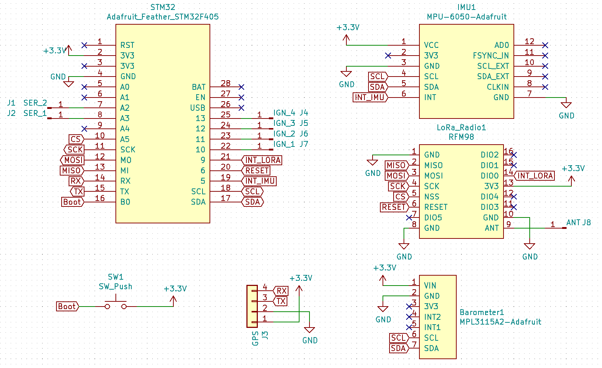
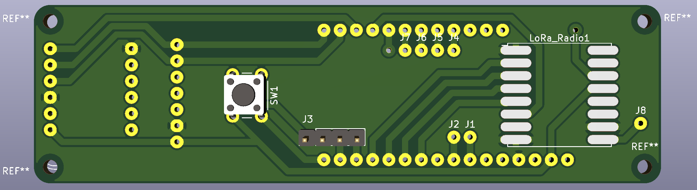
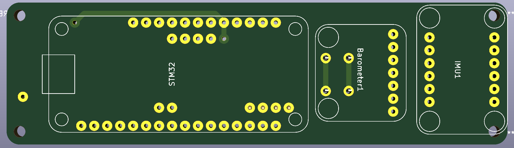
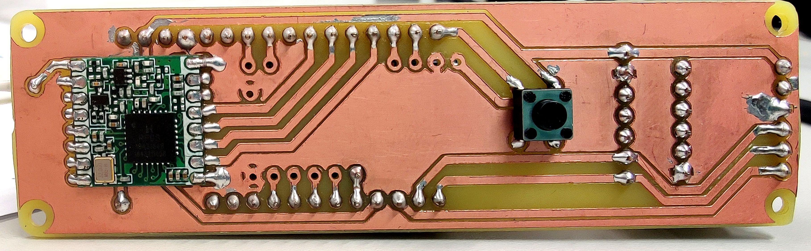

# Avionics Component Breakout PCB

This PCB is the second iteration of the avionics PCB, and is designed to interface the FeatherSTM with the MPU605 IMU, MPL3115A2 Barometer, and RFM98 LoRa module. This PCB is also design to breakout the UART serial connection needed for the GPS, as well as connections to the gimbal servos and 4 ignition lines.

This PCB is designed to be milled, and is therefor almost completely single sided. There will however need to be one mod wire connected if this PCB is milled on one side, which will connect the LoRa interrupt line to the interrupt pin.

To assemble this unit, either directly solder the components to the board, or solder on female headers with which to connect them. Then solder on the RFM98 castellated module and connect a solid core wire to the antenna.

## Schematic

## PCB Routing

  

## Assembled Unit

 
