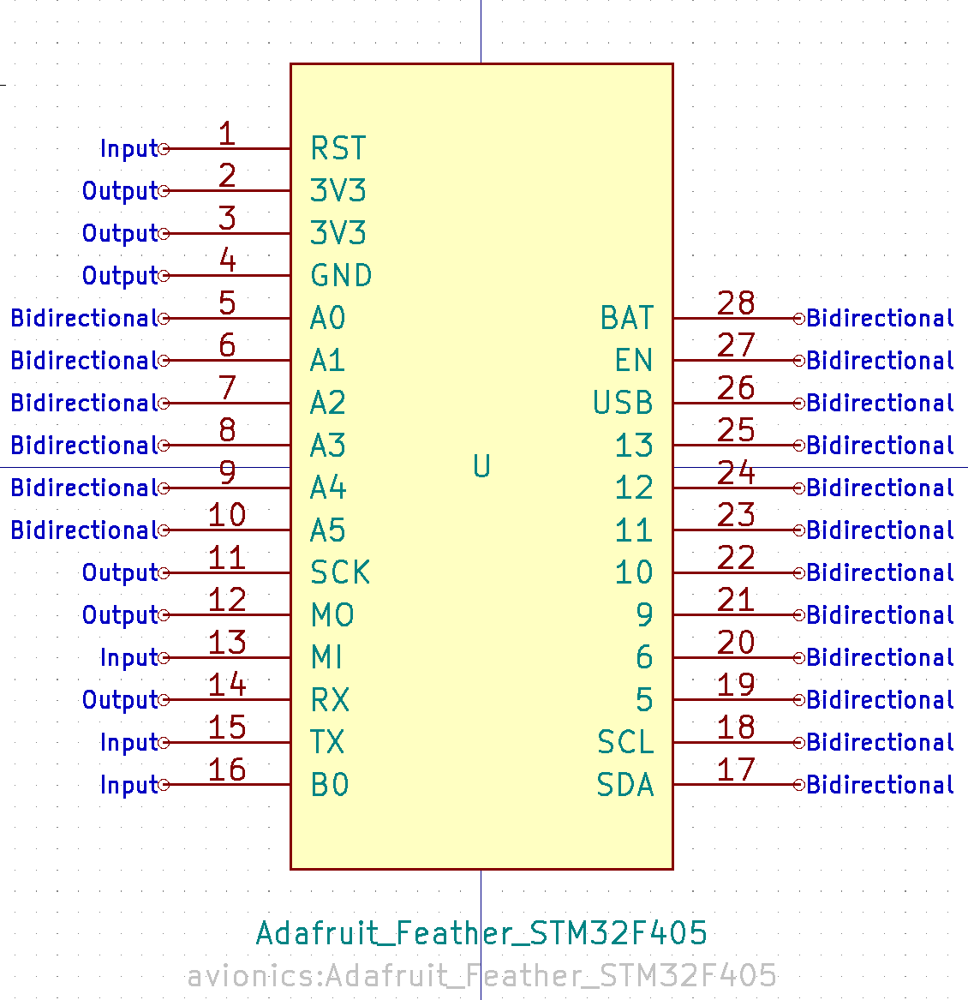
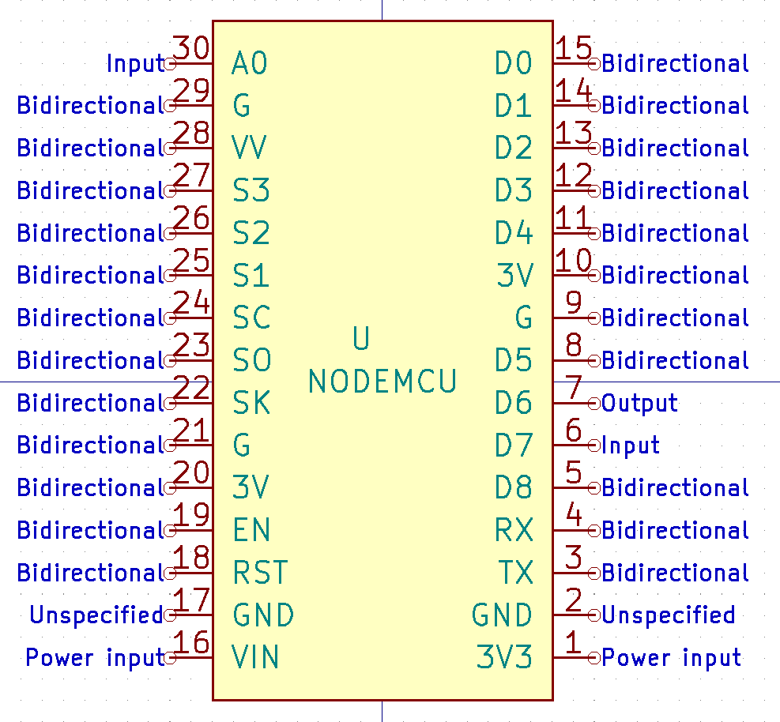
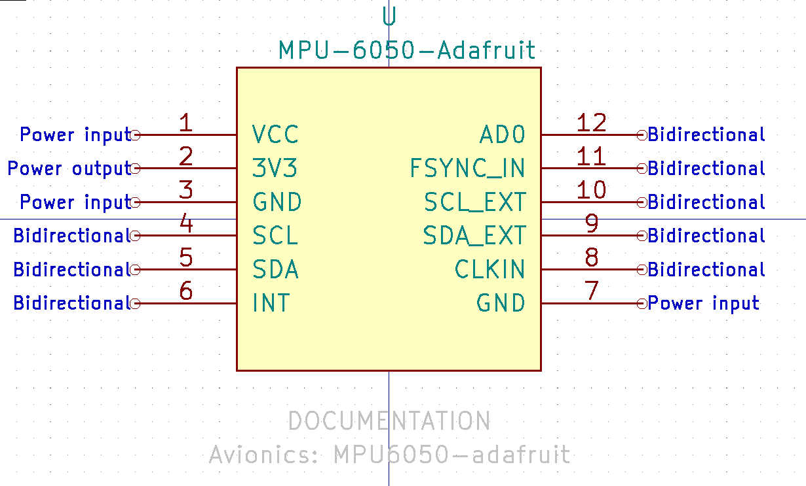
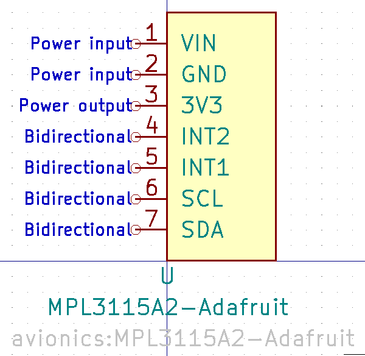
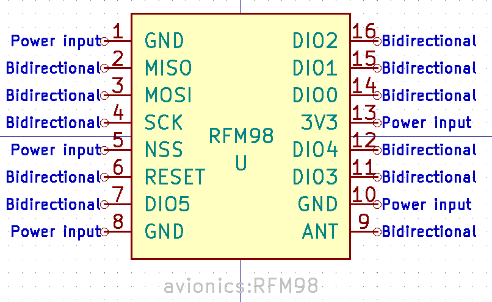
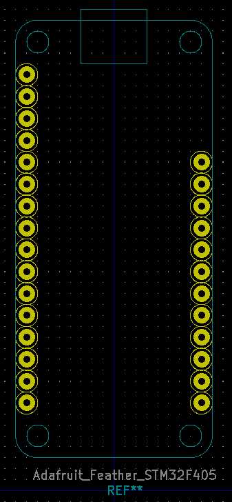
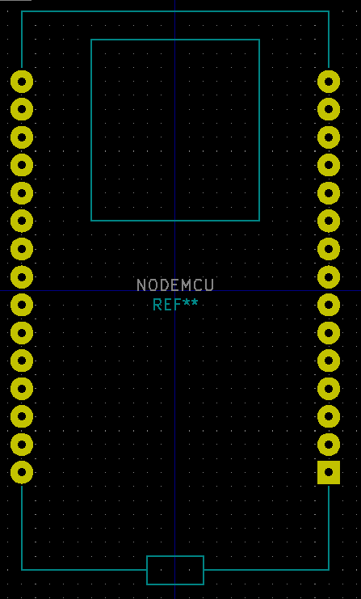
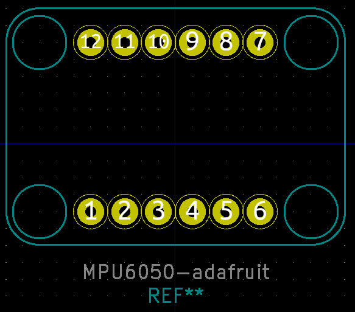
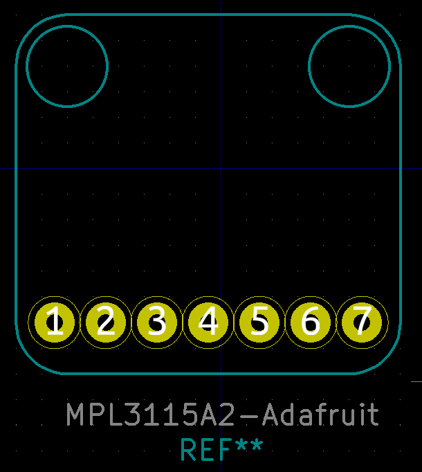
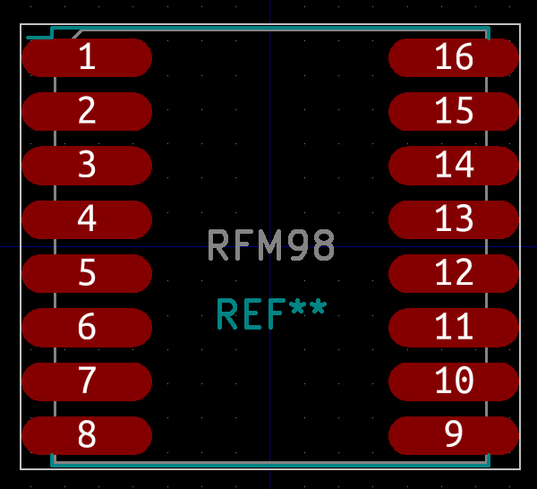

# Avionics KiCad component library

This library contains all custom footprints and symbols that have been designed for use on the avionics PCB.

## Symbols

### Feather STM32 Breakout Symbol

### NodeMCU Breakout Symbol

### MPU6050 IMU Breakout Symbol

### MPL3115A2 Barometer Breakout Symbol

### RFM98 LoRa Radio Breakout Symbol

## Footprints

### Feather STM32 Breakout Footprint

### NodeMCU Breakout Footprint

### MPU6050 IMU Breakout Footprint

### MPL3115A2 Barometer Breakout Footprint

### RFM98 LoRa Radio Breakout Footprint

