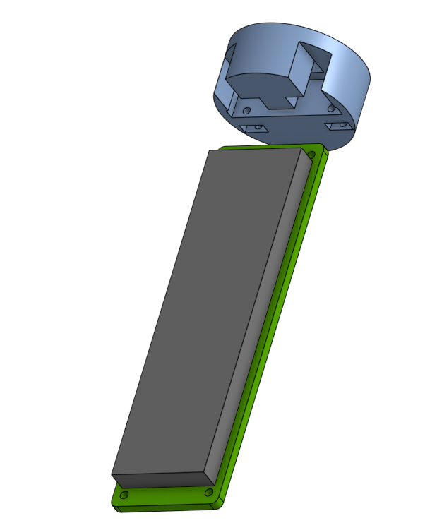

### Documentation of 3D rocket body model:

I discussed modelling the rocket body with Andre and several changes to this have been decided (strike throughs in component section due to this). Andre has an existing rocket 3D model that he has already launched and tested and recommended using that rather than starting from scratch. The reasons being, other than time, is that it has been assembled and flown before, there are Openrocket files for this containing the parameters the program needs to simulate it. This will help speed up the project substantially. Andre could possibly help with components as it already exists. The rocket model is uncontrolled so the gimbal will have to be added along with other modifications to fit out avionics package.

 [Onshape Assembly of rocket body here](https://cad.onshape.com/documents/680992436589857c3900b920/w/8b2925f5f640ad1ec1b9204e/e/6e3dd653e3c04d2cc172e233)
 
 

 [Onshape Workspace of PCB](https://cad.onshape.com/documents/71e9c78daa8c1a91f233bff0/w/2951bcb33e576e52ddc079f6/e/4d63be65ce518ef8f36620f9)

**Components**
* **Gimbal**
 * Status: completed Gimbal Prototype 4 is the final version. A stand for this is also included.
 * Gimbal requires: 2x(12mm M3 bolts), 2x(9mm M3 bolts), 3x(6mm M3 bolts), 4x(6mm M2 bolts), 6x(M3 Nuts).
* **PCB housing**
 * Status: Done.
 * Requires: 2x(9mm M2 bolts), 6x(M2 Nuts).
* **Dowel**
 * Part of Andres rocket (done)
* **Main housing tube**
 * Part of Andres rocket (done)
* **Cone & Chute storage**
 * Status: Ejection charge and Parachute Mechanism are not completed. Compartment exists on Andres rocket already, along with the cone.
* **Battery**
 * Status: Battery has not been decided on. There is a space for a battery in the rocket tube. Require the dimensions for this to design a cage for it.
