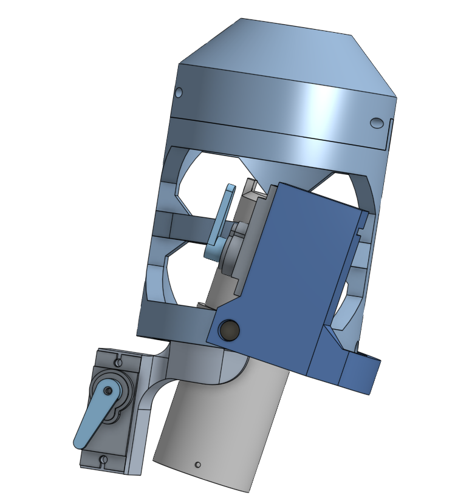

# Gimbal Prototyping Document

This document will contain progress of the gimbal and any important changes made between prototypes
(Note: prototypes are not related to Project Prototypes, they just reflect large direction changes in design decisions. This is to assist with version control).
Important specifications and measurements are included throughout.

### Motor sizes:

|| C class            | D class | E class | F class |
|:-------------------|:--------|:--------|:--------|:------|
| **Diameter (min)** | 18mm or 24mm    | 24mm    | 24mm    | 29mm  |
| **Length (min)**   | 70mm    | 70mm    | 95mm    | 114mm |

For this project the C or D class motor is to be used. Therefore, the gimbal is designed to fix
a motor of 24mm in diameter. This also allows most variety in motor fit if motor size needs differ.
***
## Prototype 1

**Log:**
- Prototype 1 Gimbal components modelled in Onshape (sprint 4)
- Assembly of components and servos finished in Onshape (sprint 5)
- ~~ ToDo: Print Prototype 1 in sprint 5 ~~
Due to printer issues there was a delay in printing and the design was reconsidered in this time, leading to prototype 2. For this reason Prototype 1 was never printed.

### Considerations for P2 based on P1

- There are a few sections on corners that are too thin and may break.
  These must be filled out.
- There are several considerations regarding bolt mounts that must be
  changed.
  - Must be reinforced else bolts will crack the plastic.
  - Diameter of holes should be 0.2mm less than the bolts, this will
    allow the bolt to thread the plastic.
  - Nuts are not entirely necessary for servo mounts. Can just make
    deeper holes.
- Servo Measurements were incorrect in P1.
- P1 has 20 degrees of freedom in one axis and 10 in the other. This
  is a more than sufficient but could be improved by ensuring it is uniform in limits.
- Generally thicker pieces to ensure strength.
- Should minimize overhangs for better printing.
- P2 should have mounts for the rocket, distance between center of mass
  and gimbal rotation axes must be considered (cannot be too small else
  insufficient torque on the rocket for change of angle).

***
## Prototype 2

#### Specs:

- M3 bolt size (8-9mm long partially threaded) (Servo screws are M2.5
  (x4))
- If length is not 8-9mm the design will need to be modified to account
  for this.
- another option for bolts/screws is using nuts but embedding them in
  the design (will required modification).
- Motor diameter 24mm

***Log: Create and assemble prototype 2 (for 24mm engine)***:

- *Made Gimbal Tube*
- *Made inner and outer rings where axes of rotation are mounted.*
- *Added upper and lower servo mounts to rings*
  - *Mounts are made to be the same offset from their respective axis of rotation. This is to ensure same angle change, show make control system easier to tweak.*
- *Added structural support to servo mounts.*
- *Screw holes added to mounts.*
- *Created Assembly.*
- *added anchor for wire that attaches to servo lever.*
- *Bolt types confirmed, fixtures made for M3 9mm/6mm bolts and nuts.*
- *Updated with fixtures for rocket body to attach.*
***
## Prototype 3

The gimbal itself is kept the same as 2 with a few reinforcements. The additions for this include the fixtures to the rest of the rocket body. This gimbal has been printed and will serve as the final version for this project. Small changes may still be made to the model as design flaws are discovered on the printed gimbal to assist those who many print this in future.

**Log: Create and assemble prototype 3 (for 24mm engine)**:

- *reinforced several bolt holes and thinner areas*
- *Added a structure extending up to attach to a 10mm thick shaft that will connect to the rocket body. This is desired as it will increase the torque of the gimbal on the rocket. This should hopefully reduce difficulty of tuning the controller.*
- *Created assembly and had to make a few modifications to ensure the functionality remains.*
  - *added a ring near top of inner tube that will act as a uniform angle limiter, this must be calibrated so the max absolute angle of the gimbal is know (10 degrees or less is ideal at this stage).*
- *Added a stand for the gimbal. May need to change the size for better stability. Gimbal has been printed but the stand is yet to be finalized and printed.*

###### Printed Gimbal:

***
## Prototype 4 - Final

To ensure linear relation between servo angle and motor angle this design was made. The upper servo was changed so that is was not fixed when the other servo moves. The inner ring that acts as a angle limit has been increased in size to further limit movement. This prevents other components blocking movement before it can. This was a problem in the printed design.

**Log: Create and assemble prototype 4 (for 24mm engine)**:

- *Modifications were made to PART 3, a new part is now added to give the upper servo an axis of rotation*
- *Offsets to motor was maintained*
- *Angle limiting ring was made larger*
- *remade many of the reinforcement structures as large changes were made to PART 3*
- *Modified Gimbal stand with bolt fixtures incase rocket is too unstable for the stand. So may need to have stand fixed*
- *A launch rail is likely to be used, so added section to attach a wire ring to*

###### Free movement addition:

***
