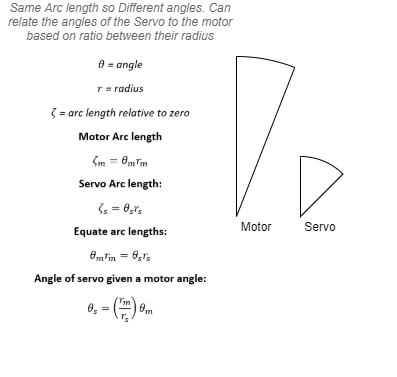
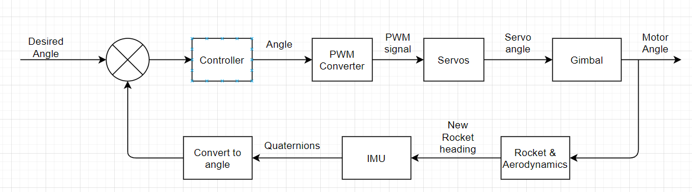

#### Mathematical modelling:

~~This directory will contain mathematical relations between certain aspects of the rocket that the control system will need along with a block diagram connecting them all.~~ Changes since talking to Andre about this: The avionics package is what we are delivering rather that the rocket. Users will have their own rockets most likely so having any modelling that is specific to the rocket body is not worth doing. Some relations are still worth doing. Those that are relevant to the gimbal, servo libraries and the control system loop in general.

***
**Motor angle to gimbal angle relation**

*For gimbal prototype 4:*

 **Motor radius = 38mm**
 **Servo radius = 16.3mm**

***
**Block diagram for avionics control system**

*general diagram*

*WIP: add specific values and isolate the avionics package component*
***
