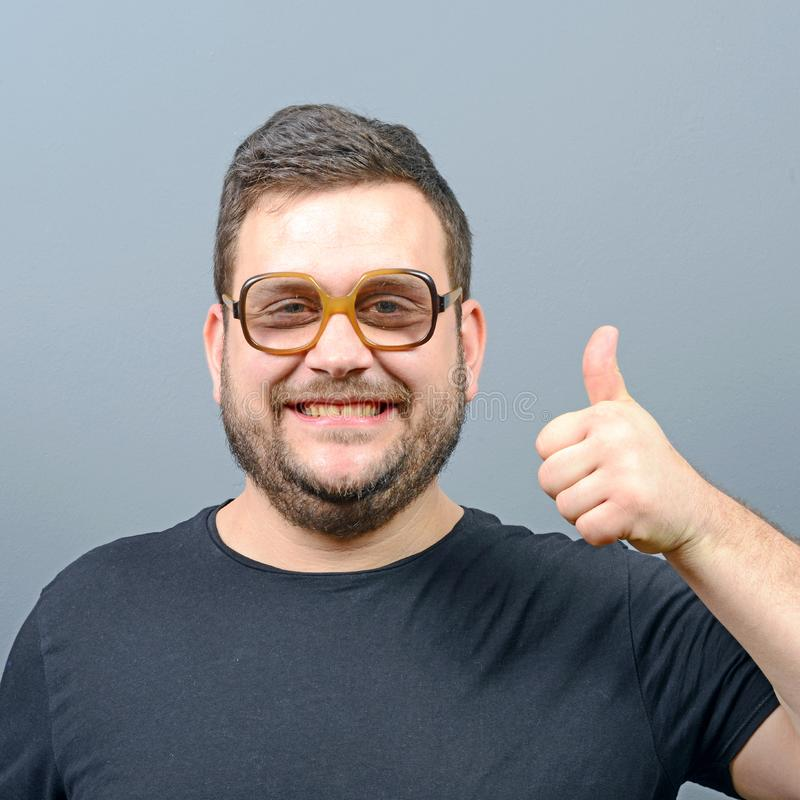

# Christopher

**Age:** 27

**Profession:** Be-Sci Student

**Blurb:** Although Chris is a particularly busy guy, he isn’t the best
at getting anything done. Chris is known to be rather indecisive, which
is why he is still at University. Chris wasn’t initially experienced
with tech originally. But after 2 degree changes and numerous unfinished
personal projects, Chris has accumulated a broad but shallow range of
tech knowledge.

***Background knowledges and skills:***

- Chris is particularly great at starting out new projects.
- Due to the sheer number of hobbies he has accumulated, Chris has
  developed a great interest in researching new areas. This allows him
  to be able gain a quick understanding of new concepts, even with
  limited documentation.
- Some of the previous projects he has worked on have contained limited
  amounts of C and Assembly. This background experience means that he is
  relatively comfortable working in any lower level language. However,
  he may not pick up on some of the more advanced language specific
  concepts.
- Part of Chris’ new found passion for technology was founded when he
  became a member of the University robotics club.

***Motivations:***

- Chris is motivated by new ideas. Without any new changes or stimulus
  in life, Chris becomes easily irritable and unfocused.

***Information Processing Style:***

- When facing new challenges, Chris’ broad understanding of technology
  and ample research experience allows him to understand new concepts
  quickly.

***Attitude to Technology:***

- ***Computer self-efficacy:*** Chris’ attitude toward technology has
  changed significantly in the last few years. It is burning with
  passion but particular interests are rather unstable.
- ***Attitude towards risk:*** As Chris has done a lot of different
  things, he has become desensitised towards any inherent risks
  associated with his personal hobbies. Someday this inherent lack of
  caution might finally catch up to him.
- ***Learning Process vs Tinkering:*** Although Chris likes to tinker
  with things, these changes are often purely cosmetics. Chris likes to
  do this to add some flair and make projects his own. However, as Chris
  never dives too deep into hobbies there is a good chance that he will
  leave the core untouched.
