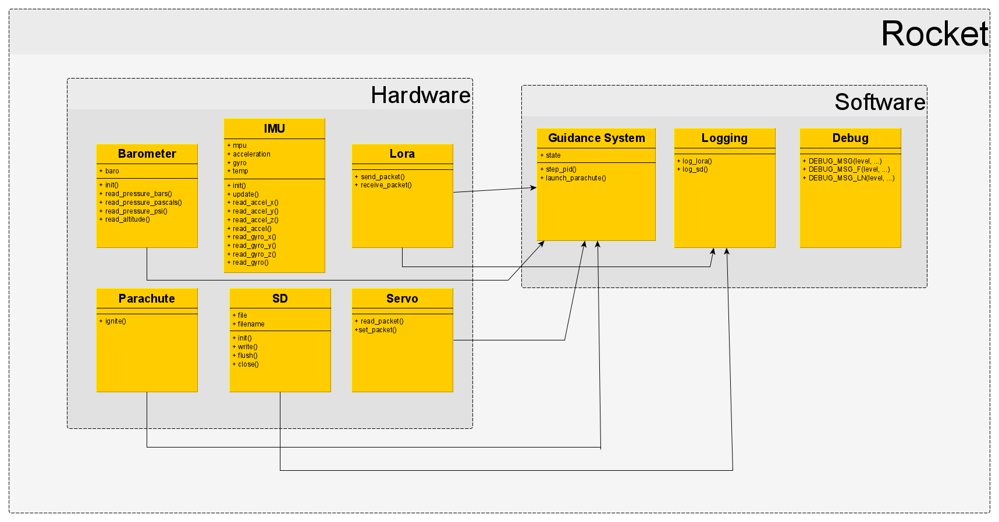

# ENGR 301 Project Beans Project Proposal and Requirements Document

[[_TOC_]]

## Authors

Billy Robb, Niels Clayton, Finlay Sargisson, William Fowler, Ron
Crisostomo, Zac Scott.

---

## 1. Introduction

Rockets ranging from NASAs Saturn V to an amateur's first model rocket
require stability in order to perform as intended. The method in which
stable flight is achieved varies to a large degree, but can be divided
into two basic categories. The most common being passively stabilized
rockets. These maintain a stable flight due to passive aerodynamic
features, an example being fins that give the rocket a stabilizing
rotation (similar to the effect of rifling on a bullet). The simplicity
of a passive system is appealing but any error introduced to the system
can cause an unwanted flight trajectory. Some examples of such errors
include, unexpected wind or differences in fin sizes which are not
accounted for in the design. The second category is an active control
system. Onboard electronics can be used to achieve active course
correction. Error in the rocket's trajectory can then be mitigated in a
way that passive systems cannot. The drawbacks of this are the
complexity and large overhead introduced when constructing the rocket.

Our customer has plans to eventually launch a rocket from a weather
balloon at approximately 70,000ft. This application requires the use of
an active control system. Existing off-the-shelf avionics packages for
amateur rocketry enthusiasts are available, however, do not meet the
full requirements of our customer. This is due to limited functionality
and the need for software to be open source to allow for further
development of the package at a later date. In conjunction with
implementing an active control system this project also aims to improve
on a previous design provided by a team in 2018. This project will also
be running in parallel with two additional projects (mission control and
simulation) to provide the customer with a comprehensive solution.

### Client

Our client for this project is Andre Geldenhuis. Andre is a rocket
enthusiast who is part of the NZ Rocketry Association. As of writing
this this their contact email is "andre.geldenhuis@vuw.ac.nz", and
throughout the project the team can also contact Andre via a live text
chat (Mattermost Customer channel).

### 1.1 Purpose

The purpose of this system is to create a rocket which can be controlled
in flight while remaining open source and accessible, so that it can be
further developed by the amateur rocketry community, and contribute to
the existing body of knowledge.

### 1.2 Scope

The objective is to deliver an avionics system that will allow stable
controlled flight while simultaneously logging and broadcasting data.
This system should improve on the existing avionics package created by a
team in 2018 for Andre. There is no requirement on height or flight
time, only to demonstrate controlled flight. The flight data must be
logged to an onboard SD card, and the broadcast data must be accessed in
real-time by an onsite personal computer (base station). The rocket must
also, upon request, be capable of broadcasting its current location via
GPS. The rocket is expected to support C or D class solid fuel rocket
motors. The key improvements as compared with the 2018 avionics package
are, a reduction in onboard PCB size and reliability in the field. To be
considered more reliable the avionics package should initialize and
launch on the first attempt. The package must also not have loose wires,
exposed electronics and implement robust code to support this.

### 1.3 Product overview

#### 1.3.1 Product perspective

There is no specific larger project that this system will be integrated
into, rather it is intended to contribute to our customer's long term
ambitions and the body of knowledge in the amateur rocketry community
alike. Our client is aiming to one day launch rockets from a weather
balloon. This will require a system that can launch and achieve stable
flight from a platform with active control. Due to this the project's
main focus is on designing a robust active control system that can be
adapted later on to help the client reach their goal.

This project is open source, allowing the final product to be tweaked
and repurposed by the community. This adds longevity to the project
after it is officially ended. This can benefit the customers as this may
result in further development by the community.

A similar open source project was produced in 2018 for our customer.
Therefore, this project, where needed, will make use of existing
resources to ensure an improved solution is provided to the customer.

#### 1.3.2 Product functions

The requirements specified for the client's minimum viable product
include:

##### Base functionality Requirements

- A rocket that achieves stable flight with an active control system
  without the use of a launch rail.
- Records data from all sensors at a rate where the flight path could be
  reasonably reconstructed post flight.
- Broadcasts radio telemetry and battery level during the launch, burn
  and post-burn phase of flight.
- Recovered post flight without sustaining significant damage to the
  electronics.

##### Required functionality Improvement

- Software can be reliably initialized in the field.
- Software is held to a high level of quality and robustness.
- Must have protected electronics, wires and PCBs cannot be exposed.

#### 1.3.3 User characteristics

One of the key requests from our client is that the avionic package will
be open source, which allows use and potential continuation of this
product from anyone in the wider amateur rocketry community. Future
users could include but it not limited to students, researchers,
programmers and rocketry hobbyists.

Since there is a wide variation in potential users, it is recommended to
have experience in certain technical areas prior to developing parts of
this project. These include:

- When installing the electronic components.
- Interfacing between the software and hardware.
- Complying with Civil Aviation Authority Regulations.
- Configuring telemetry functionality.
- Operating aircraft applications

Users should have an understanding of how this package will be applied
to their own specific projects. It's also important that the users are
able to fully comply with all of the health and safety regulations
required by their local authority on civil aviation if a rocket is
to be launched.

#### 1.3.4 Limitations

**Sensor Data and broadcasting limitations**:

One of the main requirements is to store sensor data. This must be done
at a fast enough rate. Not all of the sensors have the same polling
speed so the complete state of the rocket (as seen through the sensors),
can only be updated at the rate of the slowest sensor.

Terrain, distance and weather conditions will affect the strength and
reliability of the broadcast data to the base-station. This will limit
the range and conditions in which the rocket can operate in. The rocket
should only be operated granted line of sight to the base station to
ensure a reliable connection.

GPS data is also likely to become inaccessible during flight. This means
that there should be no in flight dependencies placed on this data.

**Conditions**:

The rocket is not designed to be waterproof, neither is the control
system designed to handle interaction with rain and high wind speed.
Therefore, for protection of the onboard electronics, the rocket should
be launched only on clear days with a wind speed less than 10 knots.

**Launch sites**:

Due to the dangerous nature of a rocket, locations where the rocket can
be tested is limited. Open spaces with high visibility and with no
people within a safe distance are the required constraints.

---

## 2. References

\[1] “Rocket Safety,” NZ Rocketry Association. [Online]. Available: https://www.nzrocketry.org.nz/rocketry/rocket-safety. [Accessed: 30-Apr-2020].

\[2]
Part 101 Gyrogliders and Parasails, Unmanned Aircraft (including Balloons), Kites, and Rockets Operating Rules. [Online]. Available: http://www.aviation.govt.nz/rules/rule-part/show/101/4. [Accessed: 13-May-2020].

\[3]
“Vectored Thrust,” NASA. [Online]. Available: http://www.grc.nasa.gov/WWW/K-12/airplane/vecthrst.html. [Accessed: 13-May-2020].

\[4] “Licenses & Standards,” Licenses &amp; Standards | Open Source Initiative. [Online]. Available: https://opensource.org/licenses. [Accessed: 16-May-2020].

\[5]
“Radiocommunications Regulations 2001,” Radiocommunications Regulations 2001 (SR 2001/240) (as at 01 October 2017) Contents – New Zealand Legislation. [Online]. Available: http://www.legislation.govt.nz/regulation/public/2001/0240/latest/DLM71513.html. [Accessed: 02-May-2020].

\[6]
“Radiocommunications Regulations (General User Radio Licence for Short Range Devices) Notice 2019 - 2019-go1588 - New Zealand Gazette,” New Zealand Official Crest. [Online]. Available: https://gazette.govt.nz/notice/id/2019-go1588. [Accessed: 02-May-2020].

---

## 3. Specific requirements

### 3.1 External interfaces

#### Radio Antenna

The radio antenna will facilitate the transfer of data and commands
between the avionics package and the base station. This radio antenna
must allow for the live broadcast of the package's geographical location
data which will be provided by the GPS unit post flight. This will allow
for easier retrieval of the unit by the customer. While in flight, the
radio antenna will also facilitate the periodic sending of other sensor
data to the base station for use in live monitoring of performance. The
data to be sent will include the following but is not limited to:

- Current gimbal position/angle
- Directional acceleration data
- Battery voltage

This radio antenna will also allow for commands to be sent from the base
station to be received and processed by the avionics package. These
commands will be able to query a range of settings and readings
pertaining to the status of the avionics package as well as alter them.

#### External: SD Card

The avionics package will be required to facilitate the logging of
launch and flight data to an onboard SD card. The SD card will store
data provided by the inertial measurement unit, as well as the
geographical location data from the GPS unit. Following the retrieval of
the SD card, the data will then be compiled into a CSV file and saved to
the external drive. There the data can be used to analyze the
performance of the system during launch and flight.

Due to this functionality the SD card must be capable of writing data at
the same rate (or faster) than the rate it is polled from the sensors.
At the same time this process must not impact the performance of the
active control system.

#### External: Inertial Measurement Unit (IMU / Sensors)

In order to identify the relative position, momentum and orientation of
the rocket throughout flight, the avionics package needs to track its
linear and angular acceleration.

This is performed by the Inertial Measurement Unit (IMU) of the avionics
package. The IMU will be poll for for 9-axis gyroscopic data, as well
as linear acceleration data, which will be used to track the position
of the rocket relative to the launch site in real time. This is required
by the active control system and is also written to the SD card for
analysis and troubleshooting.

#### External: Guidance System

The avionics package will be required to facilitate controlled flight
with self correction. To achieve this, the avionics package will contain
a guidance system consisting of a tuned PID (proportional, differential
and integral) controller. This unit will take the IMU data as well as
the current position of the gimbal as inputs. It will then output
positional information which will be used to alter the current position
of the gimbal, in turn altering the position of the rocket via vector
thrust \[3]. The guidance system will be required to process this data
at the same rate it is polled from the IMU, allowing for real time
corrections. This guidance system will also log its outputs to the SD
card for analyzing the performance of the unit, and for tuning the PID
controller.

#### External: Gimbal

The avionics package will require a gimbal unit to interface with the
gimbal hardware of the rocket. This unit will be required to apply
positional changes to the gimbal, as well as keep track of the current
position of the gimbal, accounting for any drift in the positions of the
servos due to forces applied by the motor charge.

#### External: GPS

The avionics package will be required to facilitate the retrieval of GPS
coordinates. This GPS data must be accurate to within a 5 meter radius,
and will be passed to the radio antenna unit for broadcast to the base
station. This will be used to help locate the rocket after a successful
launch. The GPS unit will also log all of its outputs the SD card.

### 3.2 Functions

#### 3.2.1 Use Cases

There are not that many unique uses for this project, as this is
designed with the sole goal of creating a rocket which operates
autonomously after launch. As parts of this project contain dangerous
goods, it's not advised to use this package for different purposes
without careful consideration and alterations. That being said there are
still various interactions between users and the rocket.

**_Use Cases:_**

1. **Launch the Rocket:** This is a primary use case and therefore most
   important use case for this project.
2. **Transportation of Rocket:** It is important that the rocket is
   handled safely, and for this reason, it will be handled by a
   professional. The specifics of this are outlined further in the
   safety plan.
3. **Assembly of rocket:** The rocket is designed with different
   packages and components which must be assembled before launch. This
   is a process which should take less than 15 minutes, and is well
   documented in the supplementary assembly instructions.
4. **Disassembly of rocket:** This is important as the rocket needs the ability
   to add or remove components for a range of reasons, i.e. faulty or
   outdated components. It also allows future users to
   extend the product. This is also covered in the supporting assembly
   document.
5. **Reading of flight data:** It is important to record all flight
   data, as this provides the users insight as to why the system behaved
   as was observed. This data will be sent to the base station during
   flight, and is visible to the team positioned at the base station.
6. **Analysis of flight data:** In addition to reading the data, it is
   also important to formally record the data. This gives users the
   opportunity to perform further analysis, and to apply improvements
   for future launches.

#### 3.2.2 Requirements

This subsection is broken down into three subsections, and aims to
identify all of the requirements necessary for the product to perform
the use cases outline in the previous section. The functions specified
by the customer's Minimum Viable Product are of primary concern to best
ensure the project is considered successful. Following the minimum
viable product, additional functions specific to hardware and software
are listed which

**_Requirements / functions of the Minimum Viable Product_**:

1. **The Rocket is safe to transport:** As the motor is classified as a
   Class 1 dangerous goods (New Zealand Land Transport Rule: Dangerous
   Goods 2005) considerations regarding safety features and transport
   procedure are necessary. Included in the safety plan (section 2.2) is
   information detailing the necessary precautions and procedure.
2. **The rocket is re-usable:** The rocket is intended to support
   multiple launches. This ensures that the rocket is designed to a high
   standard and offers greater value to the customer. For these reasons
   the rocket is expected not sustain significant damage within the
   first ten launches.

3. **The group is able to conduct post flight analysis:** This means
   that all necessary flight data is recorded and sent to the base
   station during flight. This ensures that upon both successful and
   unsuccessful launches the team is able to further analyze the flight
   in detail.
4. **The rocket is tunable/tweakable for optimization:** This means that
   there are no unnecessary dependencies between packages. This should
   reduce "god objects" and help to make all packages as interchangeable
   as possible to provide the user with more options
   when attempting to optimize the system. It also means that once built,
   the rocket is able to be disassembled with relative ease.
5. **Once flashed the rocket can be assembled and ready to launch within
   15 minutes:** Essentially from starting the assembly process of the
   rocket it should be ready for launch within 15 minutes. This allows
   the user to perform multiple launches within any given excursion and
   capitalize on ideal environmental conditions. It also means more time
   can be allocated to minor tweaks at the launch site.
6. **The rocket consists of a single kit:** This means the rocket can be
   easily transported and decreases the risk of losing launch critical
   components.

**_Hardware Requirements_**

1. **Physically withstand high acceleration:** Due to the nature of model
   rockets, all components of the rocket must
   be able to withstand significant acceleration. It is crucial that no
   component becomes loose or dislodged during launch as this poses a
   safety risk and may also result in further damage to the package. To
   be conservative, the rocket must be rated for up to 20 meters per
   second per second of acceleration. To ensure the rocket meets this
   requirement, measures such as secure mounting and bracings must be
   implemented on the rocket.
2. **Safe and controlled landing:** Due to the potential altitudes of model
   rockets using class D and E motors, an uncontrolled landing can cause
   significant damage to both the rocket itself, as well as any people or
   objects in the surrounding environment. To ensure the rocket is safe,
   it is essential that the rocket performs a safe and controlled
   landing, without drifting too far from the initial launch position.
3. **The rocket fits within a 29mm airframe enclosure:** This hardware
   requirement is an extension of the usability requirement where the
   rocket must be contained within a single kit. The dimensions of the
   rocket would affect how its internal components are structured. A
   smaller rocket promotes efficient use of space and more affordable
   components.
4. **Rocket components must be easily accessible to the public:**
   As this rocket is to be open source. It is a requirement that all
   components can be reasonably obtained or produced by a member of the
   public. This extends the lifetime of the rocket and reduces the risk
   posed by unforeseen component failure. This also includes any parts
   used to produce or assemble the PCB / components of the rocket. 3d
   printed parts, will also contribute to the assembly to help achieve
   this.

**_Software Requirements_**

1. **Control system adaptation to varying wind velocities:** The Rocket's
   software must be capable of handling wind speeds up to and within the
   maximum wind threshold specified inside the safety document. This
   requires the control system to offset any biases and deviations
   introduced by the weather conditions.

2. **Logging:** The rocket must log all flight data. This will include
   the logging of all internal sensor data, as well as commands issued to
   the IMU. The components in particular whose readings should be logged
   include the IMU, Radio and GPS. The readings must be logged to a file
   within the SD card for post launch analysis as well as critical data
   broadcast over LoRa.

3. **Mid-flight error correction:** The rocket's software must attempt to
   perform in air error analysis. This critical component of the rocket
   is fundamental to the safety of the rocket and any people or objects
   in the surrounding area. It is critical the rocket can respond
   correctly to erroneous data. Erroneous data could be observed via any
   readings from components whose output is part of the integral control
   system. This includes the IMU, battery and the SD card.

### 3.3 Usability Requirements

The usability requirements should enable any individual from the wider
rocketry community to launch and operate the rocket and its accompanying
avionics package with relative ease. To ensure this, all hardware and
computer interaction stemming from the package's use cases must be
assessed against various heuristics.

#### Scenarios and Use Cases

##### Usability: Transporting

The rocket should feature the following properties to make it portable
and easy to transport:

- Contained within a single kit.
- Weigh no more than 1.5kg as per the NZCAA regulations \[2]
- Possess reasonable dimensions (must fit within a 29mm airframe as per
  the hardware requirements)

##### Usability: Base Station Setup and Interactivity

Prior to commencing the launch sequence, the rocket needs to establish a
connection with the base station module. The base station module
consists of a laptop and LoRa receiver to transmit commands and queries
as well as receive data. Base station setup should take 5 minutes
maximum.

##### Usability: Pre-Usability: Flight Tuning

The system needs to facilitate quick changes to the control system for
the different phases of flight, so that the flight characteristics can
better meet those required for a specific launch. This pre-flight tuning
interface should be in the form of a basic input/output system to
minimize the time required to make changes. **It is crucial that user
input is validated** to prevent the system from entering an incorrect
state.

##### Usability: Launch

During launch, the usability of the system should be centered around
reliability and safety. The rocket should feature the following features
to ensure this:

- The rocket should feature manual ignition to minimize the risk of
  premature ignition
- Ignition system should feature at least a 10m wire from the motor of
  the rocket to ensure the safety of the person igniting the rocket
- Launch critical features of the rocket are clearly marked and labeled
  for easy identification
- Hardware features to help mitigate the risk of incorrect operation of
  product, such as incorrect battery polarity.
- Software safety checks and pre-flight diagnostics to ensure all
  systems are operational
- Setting up the rocket should take no more than 15 minutes

##### Usability: Mid-Flight Diagnostics/Readings

During the flight, the system should:

- Broadcast telemetry at regular intervals to the base station to enable
  stakeholders manning the base station to monitor the flight in
  real-time
- Store readings into the on-board SD card to enable project
  stakeholders to analyze the performance of the rocket throughout the
  entire flight.
- Log all data on the base station in a readable format
- Log data at a sufficient resolution and sampling rate so that users
  are able to identify, any potential sources of issues.

##### Usability: Recoverability

The rocket needs to remain in working condition post-flight. This is
largely achieved through the use of a parachute system which is deployed
once the barometer detects an increase in air pressure. The user can
also specify a timer which will automatically deploy the parachute in
the event the barometer system fails.

##### Usability: Post-Flight Diagnostics/Analysis

At the end of a launch, the rocket should be in a state that enables the
project team and stakeholders to evaluate the performance of the rocket.
To allow this, the system should do the following:

- On-board SD card should be stored in an easily accessible part of the
  rocket to allow for quick installation and removal
- On-board SD card should be protected to withstand high velocities or
  hard impacts
- Broadcast mid-flight telemetry data should be stored onto a file at
  the base station's laptop as a backup to the SD card
- Disassembly of the rocket should take no longer than 15 minutes

##### Usability: Future Development

The purpose of the project is to contribute to the existing body of
knowledge about rocketry. To make the project usable by members of the
wider rocketry community the project requires:

- Documentation in the form of manuals
- Readable code
- Open source software available to the public.

### 3.4 Performance requirements

This section details the specific performance requirements that the user
can expect from the finished rocket.

The avionics package is expected to be capable of polling the onboard
IMU at least 100 times per second. This is important for the active
control aspect of the rocket. Due to the high velocity of the rocket,
the onboard microcontroller requires frequent input signals from the IMU
in order to make timely adjustments to the motor's vector in order for
the rocket to achieve an optimal flight path. If the IMU was polled at a
slower frequency the microcontroller would not receive sufficient
information regarding its current velocity and could overcompensate for
slight deviations resulting in stability issues. In addition to
providing active control of the rocket, the avionics package should
store these measurements at the same frequency on an SD card. These
measurements will also be supplemented by readings of the batteries'
voltage and current at a frequency of 10 measurements per second to
provide sufficient data to the user for post flight analysis.

Assessing the flight path, the rocket should be capable of consistently
achieving an apogee greater than 4 metres above the launch pad. The
rocket should also land with a horizontal displacement no greater than
25 metres to reduce the risk of people being injured or property being
damaged.

The GPS should provide accurate readings to within a five metre radius
of the rocket. This is to ensure that in the event that the rocket's
landing position is not immediately known, the GPS is able to provide
effective assistance in locating the rocket. In addition to this, the
rocket's radio unit is expected to achieve reliable connection to the
base station at distances of up to 80 metres without line of sight. This
is so that the GPS location can be successfully broadcast to the base
station even when environmental features obstruct vision.

In terms of durability, the rocket's design is required to be robust
enough to remain fully functioning following 10 individual launches.
This requires the rocket's onboard electronics, software and body to be
designed in such a way that ensures it is capable of enduring
accelerations in excess of 120 metres per second per second. This is an
important factor as the rocket's target demographic is the budget
conscious hobbyist. It also ensures, that the user is able to tune the
rocket over multiple consecutive launches to their preference.

### 3.5 Logical database requirements

This section outlines the software system that will be implemented for
the rocket.

The software system is split into 2 main parts - Hardware, and Software.

**Please refer to section 4.1 of the [architecture document](../architecture_design/architecture-design.md/)
for technical details of the software system's implementation.**

### 3.6 Design constraints

#### 3.6.1 Hardware Design Constraints

For this project, the hardware design constraints are restrictions
imposed upon the rocket being built. The primary source of these
restrictions will come from legal requirements, given that the client
has specified only a single design constraint and has granted the
project team more freedom regarding the hardware design.

##### Physical Construction of the Rocket

According to the New Zealand Rocketry Association \[1], the physical
construction of a rocket with a motor class ranging from A-F must adhere
to the following rules:

- The rocket's body, nose, and fins are made of lightweight, non-metal
  parts only. The following materials have been approved:
  - Paper
  - Wood
  - Rubber
  - Plastic
  - Fiberglass
- The motor used must be commercially manufactured and certified.
- The rocket must be ignited through an electric ignition system with
  electric motor igniters with a removable safety interlock.
- The rocket cannot contain more than 125g of propellant.
- The rocket must not weight more than 1500g at lift off.
- The rocket cannot produce more than 320 Ns of total impulse.
- The rocket must have a recovery system in the form of a streamer, or a
  parachute, so it can land safely.
- Recovery wadding used must be fire-resistant or fire-proof.
- The rocket must not contain any payload that is intentionally
  flammable or could cause harm.

The rocket must also conform to regulation 9 of the Radio communications
Regulations 2001\[5]\[6]. Regulation 9 defines the available frequencies
for broadcast on a general user radio licence, it also specifies the
maximum broadcast power in dBW (Decibel Watts). We must also ensure that
we choose to broadcast on a frequency that doesn't have heavy traffic to
reduce the potential for interference.

In addition to these regulations, the client has specifically stated the
following hardware design constraint:

- The airframe's diameter must not exceed 29mm (preferably, the airframe
  is less than 29mm for usability and cost-effective purposes)
- The rocket must use the QFN package type for any integrated chips it
  uses.

#### 3.6.2 Software Design Constraints

##### Open Source Software

The client has clearly specified that the final result of the project is
intended to contribute to the existing body of knowledge available to
the rocket enthusiasts. The best way to ensure that this requirement is
met is by making sure that the software produced by the project is open
source and can be freely accessed by anyone. The open source nature of
our software introduces some constraints, one of which is that the
software produced during the project **cannot use non-open source 3rd
party libraries**. This limits the number of libraries that can be
utilized for the development of the software. Furthermore, the 3rd party
libraries that are used must not have any transitive dependencies with
other libraries that are not open source.

### 3.7 Nonfunctional system attributes

#### 3.7.1 Hardware Non-Functional System Attributes

##### Accessibility

The client has outlined that in previous iterations of this project, the
final product had issues with the accessibility of the physical rocket
hardware. It is imperative these issues are resolved as the client has
outlined that one of the purposes of this project is to contribute to
the wider rocket building community. Accessibility of the rocket in this
context means that the rocket will be relatively easy to assessable and
disassemble before and after launches. There must also be easy access to
all external interfaces on the rocket, including but not limited to:

- Power switch
- Launch safety interlock switch
- USB port for programming
- SD card
- Battery connector
- Parachute deployment charges

##### Reliability

It is crucial the hardware of the rocket is reliable as we are dealing
with potentially dangerous and harmful equipment. It was also specified
by the client that the hardware should retain its physical integrity when performing
simple actions incorrectly, like plugging in the battery or the sensors into the
main-board in the wrong orientation. Therefore, the reliability and accuracy of
components needs to be measured via testing to ensure that incorrect use
of certain components will not damage the hardware, or harm the user. To
protect the hardware, components such as sensors can be attached through
non-reversible connectors, or directly connected to the main-board of
the rocket. We can also ensure that all power systems are connected to
the main-board with non-reversible connectors, and that there are
reverse polarity protections present on the board.

#### 3.7.2 Software Non-Functional System Attributes

##### Correctness and Reliability

The client has highlighted that past attempts at the project by other
teams had issues regarding the correctness and reliability of the
software. This is especially important given that the project itself has
elements that are potentially dangerous. This means it is paramount that
the software works correctly and reliably. To assure the correctness of
the software, the project team will continually discuss what is defined
as correct behaviour as the project enters the execution phase. The
software will be packaged with extensive unit testing suites to prove
that the software is performing as intended. Continuous integration
testing will be setup in the GitLab repository of the project to ensure
that features merged during production do not cause errors with the
existing code base. From a coding perspective, the developers of the
software should apply programming techniques such as error handling,
pre/post condition checking and maintenance of invariants. Observing
these techniques should mitigate the risk of the software entering an
incorrect state and help ensure correctness and reliability.

##### Maintainability and Extensibility

Since the client has outlined that one of the purposes of the project is
to contribute to the wider rocket community, the software developed for
the project should be easily maintainable and extensible. This is
important since these attributes of maintainability and extensibility
should facilitate easier contribution to the project by other
individuals of the wider rocketry community. To achieve good
maintainability, the software needs to follow existing coding
conventions. Any 3rd party dependencies introduced to the software
should be well-known, easily adaptable, and adheres to a standard of
quality and usefulness agreed upon by the project team. From a lower
level perspective, maintainability can be achieved by observing the
'low-coupling, high cohesion' relationship between the different modules
of the software system. Extensibility can also be achieved by using
these techniques and is therefore important if the software is to be
added to or improved upon by other individuals after the completion of
the project.

##### Testing

Testing is crucial in the process of asserting the correctness and
reliability of the software. The testing strategy the project team will
adopt is a combination of regular unit testing and integration testing.
Unit testing will cover technical, lower-level aspects of the software
to ensure that the logic is correct. Unit testing should become a
regular part of the developer's workflow by running the unit tests
before pushing changes to the remote repository. Integration testing
will be accommodated by GitLab's CI/CD (Continuous
Integration/Continuous Delivery) feature. This will assist in ensuring
that code being merged into production meshes well with the existing
code base.

Other non-functional requirements from a software perspective include
the following:

- **Documentation** - The software package should have comprehensive
  documentation to clearly convey the intent and purpose of the code.
- **Code Quality** - The software should adhere to existing coding
  conventions and follow design patterns where appropriate. The software
  should facilitate easy maintenance and adaptability.
- **Ease of Deployment** - Deployment of the software system should be
  easy for the user. A manual should accompany the software to describe
  how to use it, and to describe any important parts of the software the
  user should be made aware of.

### 3.8 Physical and Environmental Requirements

#### 3.8.1 Physical Requirements

The physical requirments placed on the rocket stem from the physical
constraints imparted by the local authority and the client's minimum
viable product. The requirements are:

- Dimensions: The rocket will be of cylindrical shape with a nose at the
  top and gimbal at the bottom. The airframe will be 29mm in diameter
  and approximately 125mm in length. The nose cone at it's base is 30mm
  and 50mm in height. The gimbal spans 50mm in diameter and 60mm in
  height.

- Mass: Excluding the d class motor is 80g and 124.5g inclusive.

- Material: The rocket will be constructed largely from plastic
  including 3D printed parts.

The components need to be sourced from well-known NZ suppliers. In this
project most of the parts are sourced from DigiKey. Additional parts
left from the previous 2018 team are also utilised to reduce cost and
risk of part failure. These components are assembled and tested at
Victoria University of Wellington inside a laboratory. The physical
parts used in the design are:

- D-class motor: Solid fuel rocket motor supplying ~20Ns of thrust over
  2 second window.

- Adafruit Feather STM32F405: On-board microcontroller for implementing
  the active control system, communications and processing sensor data.

- MPU-6050: The IMU for providing data regarding position and momentum
  of the rocket to the microcontroller.

- Adafruit RFM96W: LoRa radio trancievers for establishing remote
  communication between the microcontroller and base station.

- Adafruit Mini GPS PA1010D: GPS module for providing positional data to
  the microcontroller.

- Secondary microcontroller for interfacing between the basestation
  laptop and LoRa trancievers.

A custom PCB design is implemented to reduce the size of the electronics
making it possible for them to fit inside the 29mm airframe. Programming
of the device is achieved by flashing via micro usb.

#### 3.8.2 Environmental Requirements

The environmental requirements are based primarily around legal
restrictions and safety requirements. According to the New Zealand
Rocketry Association \[1], a rocket with a motor class ranging from A-F
can only be launched under the following environmental circumstances:

- Wind speeds at the site of the launch do not exceed 32km/h
- No dry grass must be present near the launching location of the rocket
- People must maintain at least 5m distance from the rocket during a
  launch

In addition to the guidelines provided by the New Zealand Rocketry
Association, the New Zealand Civil Aviation Authority (NZCAA) Rules Part
101.15 \[2] places the following restrictions:

- A rocket cannot be operate on or within 4km of an aerodrome boundary
  unless permission is given by the aerodrome operator
  - If permission is granted, the rocket still has the following
    environmental restrictions:
    - The rocket cannot fly above 400 feet (121.92m) AGL (Height above
      ground level)
    - The rocket cannot interfere with the flight path of any aircraft
    - The rocket cannot be operated over an active runway
- A rocket cannot be operated within 4km to 8km of an aerodrome boundary
  if it exceeds an altitude of 400 feet AGL.
- A rocket cannot be launched in an environment where clouds or other
  obscuring meteorological phenomena has a substantial presence
- A rocket cannot be launched if horizontal visibility is less than 8km
- Rockets cannot be launched at night under any circumstance

### 3.9 Supporting information

#### Open Source

The client has communicated that their intention with the project after
its completion is to contribute to the wider rocketry community. As a
result, all of the project's content including hardware design and
source code will be freely available to the public both for viewing and
editing. This is an important factor in the design of the hardware and
software systems since it imposes certain restrictions that the project
team has to work around. Despite these restrictions, making the project
open source allows the project to be improved upon by other individuals
outside of the project team, and hopefully, provoke continued interest
for the wider rocketry community.

##### Legal Regulations

The project is subject to a wide range of legal regulations given the
potentially dangerous nature of the product being developed. **It is
critical that all legal regulations are followed by the design** of the
system as any breaches can pose a real threat to the health and safety
of project stakeholders. Furthermore, the legal repercussions from any
breaches could severely impact the project and its ability to continue.

## 4. Verification

This section outlines how specific requirements of the avionics package
will be verified. Where possible this includes testable and measurable
acceptance criteria.

### 4.1 External Interfaces

The requirements for assessing whether the individual external
interfaces have met their requirements are specified below.

#### Interface: Radio Antenna

For the radio antenna to be verified it must meet the following
criteria. The radio antenna upon request from the base station should be
able to transmit the geographical location data and be received at the
base station without error. The radio antenna must also have the
capacity to receive and respond to three distinct commands and provide
live telemetry of at least one flight critical variable during flight.

#### Interface: SD Card

The SD card storage will be deemed satisfactory if it can in any
capacity store data provided by the IMU and GPS during flight in a
format that can be interpreted by the user later. As long as the data
can be read and does not contain corrupted data, it will be verified.

#### Interface: Internal Measurement Unit (IMU / Sensors)

The onboard IMU will be verified, provided that it is able to reliably
produce data throughout the duration of the flight. The data must also
match the observed flight path of the rocket to a reasonable extent.

#### Interface: Guidance System

In order to verify the guidance system, software testing of the
controller must produce evidence that the guidance system is able to
offset/correct to any given extent three consecutive deviations in the
simulated flight of the rocket.

#### Interface: Gimbal

The Gimbal can be verified granted that it is able to vector the rocket
motor on two axis and is observed to change the motors vector at least
once during flight.

#### Interface: GPS

The GPS will be verified if and only if following the flight of the
rocket, the geographical location data produced by the unit is accurate
to within a 5 metre radius of the rocket.

### 4.2 Functions

#### 4.2.1 Verifying Use Cases

1. Launching the rocket: This use case is verified if project
   stakeholders are able to launch the rocket safely through manual
   ignition.
2. Transportation of Rocket: This use case is verified if the rocket is
   able to be transported from one location to another safely. Any
   stakeholder should be able to transport the rocket with relative ease
   unless the rocket is in a state of being susceptible to ignition, in
   which case a professional or experienced stakeholder can transport
   the rocket safely.
3. Assembly of Rocket: This use case is verified if the rocket is able
   to be assembled within 15 minutes.
4. Disassembly of Rocket This use case is verified if components of the
   rocket are able to be removed in order to be replaced.
5. Reading of Flight Data: This use case is verified if the rocket
   successfully transmits critical telemetry data to the base station
   during launch and its flight to enable project stakeholders to
   monitor the flight.
6. Analysis of Flight Data: This use case is verified if the broadcast
   telemetry data is recorded and stored in a way that enables the
   project stakeholders to analyse the flight.

#### 4.2.2 Verifying Requirements

1. Rocket is safe to transport: This requirement is verified if the
   rocket can be held and taken from one location to another with full
   assurance that it is of no danger to any person or property. The only
   exception to where it should not be safe to transport is during
   launch.
2. Rocket is re-usable: Reusability of the rocket is verified if the
   rocket does not sustain significant physical damage after a flight,
   and that a recovery system in the form of a parachute or streamer
   \[2] is implemented to ensure this.

3. System enables post-flight analysis: This requirement is verified if
   the system has a way of sensing, recording and broadcasting telemetry
   data during launch and flight. The system should log this data to
   both an on-board SD card, and the base station. The verification of
   this requirement will fail if **both** of the platforms logged to by
   the rocket (on-board SD card and base station) cannot display the
   logged data due to some failure.
4. Rocket is tunable for optimisation: This will be verified provided an
   interface exists in which the user can modify the flight parameters
   while out in the field.
5. Rocket can be launched 15 minutes after flashing: This requirement is
   verified if the assembly process of the rocket takes no longer than
   15 minutes.
6. Rocket consists of a single kit: This requirement is verified if all
   components required to assemble the rocket are small enough to fit
   into a suitable sized container.

**_Hardware_**

1. Withstanding significant acceleration: The rocket and its components
   must be able to withstand at least 20ms-2 of acceleration
   during its flight in order for this requirement to be verified. If
   components are unintentionally separated from the rocket, or is
   dislodged from its intended position within the rocket, this
   requirement will fail to meet the verification standards. Verifying
   this requirement can be achieved by ensuring secure mounting of
   components within the rocket.
2. Safe Landing: This requirement is verified if the rocket is able to
   perform a safe and slow landing as a result of deploying a recovery
   system after a set amount of time during its flight. Alternatively,
   the parachute is deployed when the on-board barometer detects an
   increase in air pressure, accompanied by a deceleration as indicated
   by the IMU. A landing that causes noticeable damage to any person or
   property despite the deployment of the recovery system will mean that
   this requirement will fail to meet the verification standard.
3. Fits within an enclosure with the specified dimensions - This requirement is verified if the
   entire rocket posses a width and diameter of no more than 220mm by
   50mm respectively. The comnponents must also fit within an airframe
   whose maximum width does not exceed 29mm. Exceeding any of the
   specified dimensions fails the verification of this requirement.
4. Open Source and Accessible: This requirement is verified if all work
   contributing to the development of the hardware system of the rocket
   is openly visible to the public, and that the total cost of all
   components is less than or equal to \$300 NZD. To verify this
   requirement, all schematics, plans and diagrams related to the
   hardware system of the rocket will be available on GitLab. Tools used
   to create schematics, plans and diagrams will be open source, or free
   to use.

**_Software_**

1. Error Correction and Control: This requirement is verified if the
   software system correctly guides the rocket to take a safe, upward
   trajectory despite the influence of external factors such as wind
   speed and direction. The software system must use a combination of
   internal sensor readings on-board the rocket, as well as data
   provided by the mission control software.
2. Logging: This requirement is verified if the software system
   successfully logs important data from the IMU, Radio and GPS to both
   an on-board SD card and base station during flight. The logged
   information must be accessible post flight, otherwise this
   requirement is not verified. This can be verified by creating a
   dedicated Logger module that logs important data to target components
   (on-board SD card and base station) during the flight at a sufficient
   rate to be useful.
3. Mid-Flight Error Analysis: This requirement is verified if the rocket
   responds to erroneous data in a way that does not cause the rocket to
   fail, or enter a state where it can no longer be trusted to take a
   safe trajectory. This requirement can be verified by conducting
   extensive software testing.

### 4.3 Usability Requirements

The usability of the rocket revolves around the idea of how the user
will interact with the system to achieve important use cases, and how
easy this is to do. To verify the usability requirements, each important
scenario/use case must have a set of criteria that must be met to
indicate that the usability of the system under that scenario has been
verified.

#### Verification Under Specific Scenarios

The following criteria specifies what must be done for each important
use case/scenario in order to verify the usability of the system.

##### Transporting

- The final version of the rocket is contained within a **single
  physical construct or kit**.
- The total weight of the final rocket and its components weigh less
  than or equal to **1.5kg** \[2].
- At its widest point, the rocket's airframe has a diameter of less than
  or equal to 29mm.

##### Base Station Setup and Interactivity

- The setup of the base station laptop, USB LoRa, and the software
  module to enable interaction between the rocket and the base station
  takes no longer than **5 minutes to setup.**

##### Pre-Flight Tuning

- A basic, intuitive input/feedback system is implemented.
- User input is validated.
- Useful **feedback** is provided to the user if invalid input is
  detected.

##### Launch

- The stakeholders are able to perform a successful launch at a safe
  distance from the rocket.
- Manual ignition is featured as the primary ignition method to assure
  the safety of the stakeholders.
- Launch critical features are easily identified by stakeholders or by
  people who are unfamiliar with the rocket as a result of effective
  marking and labelling.
- The rocket can be assembled by stakeholders in under **15 minutes**.

##### Mid-Flight Diagnostics/Readings

- Stakeholders can easily read the logged .
- Stakeholders manning the base station can make confident deductions
  about the flight as a result of a sufficient logging rate and format.

##### Recoverability

- A parachute system is deployed to enable the rocket to land safely.
- GPS system is accurate to within **5 m** of the rocket's landing site
  to enable project stakeholders to quickly locate the rocket upon
  landing.

##### Post-Flight Diagnostics/Analysis

- Stakeholders are able to retrieve the on-board SD card without the
  need to fully disassemble the rocket.
- On-board SD card is intact at the end of the flight.
- Rocket disassembly takes no more than **15 minutes**.

##### Future Development

- Documentation in the form of manuals are written to enable any
  potential user to understand the system quickly.
- Software is documented appropriately to **support the ability of
  future contributors to adapt the code**.
- The project is open source so any future contributors can easily
  access the project.

### 4.4 Performance Requirements

#### In-Flight Verification

The avionics package will have met the performance requirements provided
the rocket maintains a flight trajectory of no more than 90 degrees from
the vertical while the motor is still producing thrust. This is evidence
that the onboard controller provided sufficiently accurate and
well-timed signals to the gimbal in order to achieve controlled flight.
If the rocket deviates from the vertical by greater than 90 degrees, the
avionics package will not have met the performance requirements. In
addition to this the avionics package must achieve an apogee of at least
1 meter, and a horizontal displacement upon landing of less 25 metres to
be verified.

The avionics package must also have in some capacity, stored data
collected from the onboard IMU and GPS during flight to be verified.

#### Physical Attribute Verification

Lastly, the avionics are required to be able to perform two consecutive
launches. This provides evidence that the package is capable of
completing a launch and being recovered in working condition. Minor
damage, that is damage requiring no spare parts and less than 30 minutes
of attention to fix, is permitted. If the package fails to meet this
requirement it is evidence that its physical attributes were not
acceptable and hence the package cannot be verified.

### 4.5 Logical Database Requirements

The logical database requirements are focused around the idea of how the
software developed will be laid out, as well as the connections and
dependencies that exist between the software modules to enable each
other's functionality. This is verified as a whole if the final software
system achieves the core functionality outlined in each of the software
modules, but still retaining overall architecture of the system. This
means that the separation of duties must be enforced as the software
system is developed. By doing this, the software system will achieve
high cohesion, maintainability and good modularity.

To verify these requirements, the developers of the software system
should make a conscious effort to become familiar with the desired
architecture of the software system and the different modules that needs
to be implemented before coding it. The project team should regularly
consider if changes can be made to the logical database requirements
that will have a beneficial impact to the software system.

The logical database requirements will fail to meet verification
standards if the software system's architecture has deteriorated beyond
recognition. This can potentially happen due to poor execution and
failure to follow the outlined software architecture/layout as outlined
in section 3.5.

### 4.6 Design Constraints

#### 4.6.1 Verifying Hardware Design Constraints

The hardware design constraints of the project will have been satisfied
if the final rocket's properties abide by both legal regulations \[2],
and the client's hardware constraints.

For the legal regulations, the hardware design constraints are satisfied
if:

- The rocket weighs less than or equal to 1.5kg at liftoff
- The rocket contains no more than 125g of propellant
- The rocket's body is composed of non-metal materials
- The rocket has a recovery system in the form of a streamer or
  parachute
- The rocket's motor is manufactured by a certified company.
- The rocket must be manually ignited through an electric ignition
  system

The client has provided only a single hardware design constraint: The
rocket's airframe must not exceed a diameter of 29mm. This hardware
design constraint is satisfied if the diameter of the rocket's body is
less than or equal to 29mm, although preferably less than 29mm for
transportability, aerodynamics, and cost-efficiency purposes. To ensure
that these hardware design constraints are met, the project team will
consult these design constraints regularly during the execution phase of
the project. It is important to note that the majority of the hardware
constraints are sourced from legal regulations in accordance with the
NZCAA \[2]. As a result, the team will closely monitor if any changes to
the legal regulations occur and update the design constraints as
necessary to make sure that the hardware design constraints are verified
at the end of the project.

#### 4.6.2 Verifying Software Design Constraints

One of the primary software design constraints that needs to be verified
is whether the software is open source and hence whether all 3rd party
libraries/APIs are also open source. To satisfy this constraint, each
3rd party library the project team elects to use must be open source.
This can be achieved by making sure that the library/API is licensed
under a license that is consistent with those outlined by the Open
Source Initiative \[4]. Such licenses include the following but are not
limited to:

- Apache License 2.0
- MIT License
- GNU General Public License (GPL)
- BSD-3 Clause ("New" or "Revised" License)

Transitive dependencies (other libraries/APIs used by the 3rd party
library/API) must also be open source. If this is not the case, then the
project will fail to meet the open source software design constraint of
the project.

### 4.7 Nonfunctional System Attributes

#### 4.7.1 Verifying Hardware Non-Functional System Attributes

**Attribute 1 - Accessibility**:

The client has specified that previous attempts at the physical design
of the rocket suffered from accessibility issues. As a result, it is
important that the rocket is built to facilitate easy access to its
components. This non-functional requirement is verified if the client
can make the assessment that all external interfaces on the rocket are
accessible with minimal effort.

**Attribute 2 - Reliability**:

The verification of this attribute will rely on the fact that the rocket
and its components does not sustain any significant damage during normal
use. The rocket is considered reliable if it is able to undertake
several flights, and is constructed in a way that prevents physical
damage to its components. This also requires that the package
consistently meets the design requirements and functionailty without
issue.

#### 4.7.2 Verifying Software Non-Functional System Attributes

**Attribute 1 - Correctness and Reliability**:

The verification of this attribute requires a large amount of testing.
Verifying the correctness and reliability of the software system can be
achieved through rigorous unit testing to verify the lower level logic
of the code. Unit testing will be conducted on _all_ software modules to
verify the overall correctness and reliability of the software.
Furthermore, unit testing will be integrated into the regular workflow
of the team. This means that at every sprint, a set of test cases will
be formed, which the target software module must pass at the end of the
sprint. For software tests that require the usage of hardware components
or a fully/partially built rocket, testing will be conducted in a highly
controlled environment where the project team has full control over what
happens to the components, and the outcome is known. This attribute is
verified if the software performs as intended and is deemed as
sufficient by the project team, and the client.

**Attribute 2 - Maintainability and Extensibility**:

To verify this attribute, the project team members in charge of
developing the software must be in **full agreement** that relevant
programming techniques that promote maintainable and extensible design
were observed to the best ability of the developers. Some of the
programming techniques that can facilitate maintainable and extensible
software include the following but are not limited to:

- Observing low coupling - high cohesion where appropriate
- Adhering to existing coding conventions
- Commenting
- Proper usage of abstraction
- Observing 'DRY' (Do not repeat yourself)
- Formal documentation in the form of comments and/or API manuals

Furthermore, personas will also be used in the verification process of
this attribute. Each persona will be considered to see if that persona
can understand the code-base and the manuals provided in a way that will
enable them to make suggestions or apply changes to the code.

**Attribute 3 - Testing**:

This attribute can be verified by assessing the package against
quantitative and qualitative metrics. From a quantitative point of view,
this attribute is verified if the following conditions are met:

- 90% overall code coverage is achieved by all unit tests
- A quota of 25 unit testing methods are achieved by the end of the
  project

From a qualitative point of view, this attribute is verified if the
following conditions are met:

- All tests pass across all software modules by the end of the project
- Test cases written for a specific software module should lead to the
  software module working as expected. This will indicate that the tests
  are valid.
- A wide range of potential cases are covered, including valid, invalid
  and edge cases
- Gitlab's CI/CD feature is used appropriately to facilitate system and
  integration testing

Note that Attribute 1 (Correctness and Reliability) depends heavily on
this attribute. It is important that the verification of this attribute
is achieved, and done so comprehensively, given the potentially
dangerous nature of the product being developed by the project.

### 4.8 Physical and Environmental Verification

The physical requirements placed on the rocket can be verified provided
that:

- The rocket's airframe is less than 29mm in diameter.
- The overall dimensions do not exceed 220mm in length and 50mm in
  diameter.
- The mass of the rocket does not exceed 1.5kg.
- The rocket is small enough to fit inside of a portable container.

The environmental requirements can be verified given:

- The environmental conditions meet the requirements of the New Zealand
  Rocketry Association \[1] which specify:

- The environmental conditions adhere to the New Zealand Civil Aviation
  Authority Rules Part 101 \[2] which specify:

- The rocket adheres to the guidelines presented by the Faculty of
  Engineering and Computer Science at Victoria University which will be
  checked at all times throughout the duration of the project.

- The rocket is launched at a location permitted by the Wellington City
  Council and does not damage the surrounding property or the environment.

## 5. Development schedule

### 5.1 Schedule

**Architectural Prototype** Completed by June 19th.

**Minimum Viable Product** Completed by September 11th.

**Further Releases** Final prototype due, as well as any other planned
significant releases. Published by October 18th.

### 5.2 Budget

In total the project has an allocated budget of \$300.00 NZD.

Presented here is a table outlining the expenditure on key components.
All links and prices valid as of the 15th of June 2020.

| COMPONENT        | COST            | NAME/DESCRIPTION/LINK                                                                                                                                                                                                                                                                                                                                                                                                                                        | REASONS FOR CHOICE                                                                                                        |
| :--------------- | :-------------- | :----------------------------------------------------------------------------------------------------------------------------------------------------------------------------------------------------------------------------------------------------------------------------------------------------------------------------------------------------------------------------------------------------------------------------------------------------------- | :------------------------------------------------------------------------------------------------------------------------ |
| Micro-Controller | \$24.95 USD     | Adafruit Feather STM32F405 (168MHz) [BUY](https://www.adafruit.com/product/4382), [Github](https://github.com/adafruit/Adafruit-Feather-STM32F405-Express-PCB), [Documentation](https://www.digikey.co.nz/en/videos/a/adafruit/programming-the-adafruit-feather-stm32f405-express-with-stm32cubeide-maker-io)                                                                                                                                                | Small, Light, Good Opensource Libraries & Good Documentation                                                              |
| IMU              | \$17.59 NZD     | BNO055 [BUY](https://nz.mouser.com/ProductDetail/Bosch-Sensortec/BNO055?qs=QhAb4EtQfbV8Z2YmISucWw%3D%3D), [Datasheet](https://nz.mouser.com/datasheet/2/783/BST-BNO055-DS000-1509603.pdf), [Adafruit library](https://learn.adafruit.com/adafruit-bno055-absolute-orientation-sensor/arduino-code)                                                                                                                                                           | Good Libraries, quaternions, Better Documentation                                                                         |
| GPS              | \$61.93 NZD     | Adafruit Mini GPS PA1010D [BUY](https://www.digikey.co.nz/products/en?keywords=PA1010D), [Datasheet](https://cdn.taoglas.com/datasheets/GP.1575.25.4.A.02.pdf)                                                                                                                                                                                                                                                                                               | Cheap, Small and Meets requirments                                                                                        |
| Transceivers     | \$19.95 USD     | Adafruit RFM96W LoRa Radio Transceiver Breakout - 433 MHz - RadioFruit [BUY](https://www.adafruit.com/product/3073), [Overview](https://learn.adafruit.com/adafruit-rfm69hcw-and-rfm96-rfm95-rfm98-lora-packet-padio-breakouts?fbclid=IwAR35VbMkCNa8vlXsCGSQ_aMt7WncGXr0NET0dsGQH1ARlQAluhj9rdhM1OQ), [Datasheet](https://cdn-learn.adafruit.com/downloads/pdf/adafruit-rfm69hcw-and-rfm96-rfm95-rfm98-lora-packet-padio-breakouts.pdf?timestamp=1592280787) | SPI, Pins for extra antenna                                                                                               |
| Gimbal Servos    | \$6.97 NZD each | SERVOMOTOR RC 6V MICR METAL GEAR [BUY](https://www.digikey.com/product-detail/en/dfrobot/SER0011/1738-1232-ND/7087129?fbclid=IwAR3tHvFKb_L4hPvRHZ3XCM0uWsSMUwFsVYjAItaNuxh1T_yVfbpZaJRjYQQ)                                                                                                                                                                                                                                                                  | 15grams Small, Cheap, Has dimension specifications                                                                        |
| Battery          | \$12 NZD        | ZIPPY Compact 500mAh 2S 35C Lipo Pack [Buy](https://hobbyking.com/en_us/zippy-compact-500mah-2s-35c-lipo-pack.html?queryID=daa4b6898932867645b366984b5914b9&objectID=24762&indexName=hbk_live_magento_en_us_products)                                                                                                                                                                                                                                        | -Available in Australia, - Sufficient Charge, Voltage and Current discharge specifications, - Cheap, -Light for a battery |
| Power supply     | \$3.62 USD      | See power_supply.md                                                                                                                                                                                                                                                                                                                                                                                                                                          | See power_supply.md                                                                                                       |
| -                | ~ \$230 NZD     | -                                                                                                                                                                                                                                                                                                                                                                                                                                                            | -                                                                                                                         |

### 5.3 Risks

The content below outlines the 10 most important risks that threaten the
completion of the project goals. Attributes of each risk such as the
likelihood of occurrance and extent of impact are described as follows:

- Likelihood: - Unlikely, Likely, Very Likely
- Impact - Mild, Moderate, Severe

**Risk 1 - Rocket falls on a person causing injury**:

- **Risk Type:** Health and Safety
- **Likelihood:** Unlikely
- **Impact:** Severe
- **Mitigation Strategy:** During a rocket launch, all attending project
  members and other stakeholders/spectators are required to maintain a
  safe distance from the rocket. Any member of the public present at the
  launch site will be informed of the rocket launch so that they are
  made aware of the potential danger. During the rocket's flight, the
  trajectory and status of the rocket will be closely monitored to
  ascertain the landing location of the rocket. If there are too many
  people at the launch site, the launch will be postponed. Ensure that a
  recovery system in the form of a streamer or parachute is implemented
  \[1] to minimize the damage done by an impact with a person during
  landing. Project stakeholders involved with the rocket launch will
  maintain a minimum distance of 5m from the rocket during a launch, as
  required by the NZRA \[1].

**Risk 2 - Rocket contacts object causing damage**:

- **Description:** Rocket unintentionally makes contact with an object
  during flight or when it lands, causing damage to property
- **Risk Type:** Health and Safety, Environmental
- **Likelihood:** Unlikely
- **Impact:** Moderate
- **Mitigation Strategy:** The site of the rocket launch will be
  inspected closely prior to the launch to determine if there are any
  objects belonging to the project members or to the members of the
  public. The location of the launch site must be a safe distance away
  from any buildings, cars and roads. Ensure that a parachute deployment
  system is implemented to minimize the damage done by an impact with an
  object during landing.
- One potential mitigation strategy is to limit the altitude the rocket
  can reach. Customer specifically said that the priority of the project
  is control and that the rocket reaching high altitudes is not the goal
  or desired. This mitigation strategy can also apply to Risk 1.

**Risk 3 - Rocket takes unsafe path due to wind causing damage**:

- **Description:** Rocket's trajectory affected by winds, causing it to
  take an unsafe flight path causing injury or damge to property.
- **Risk Type:** Environmental
- **Likelihood:** Unlikely
- **Impact:** Severe
- **Mitigation Strategy:** Consult mission control software before a
  rocket launch to determine if the current wind speeds can safely
  accommodate a flight. Launches will be postponed if wind speeds exceed
  **32km/h** \[1].

**Risk 4 - Rocket disassembles during flight**:

- **Description:** Rocket parts unexpectedly disassembles during flight
  debris emitted causes damage to people and property.
- **Risk Type:** Health and Safety/Environmental
- **Likelihood:** Unlikely
- **Impact:** Moderate
- **Mitigation Strategy:** During assembly, team needs to ensure all
  components of the rocket are securely fastened. The design should
  ensure that the majority of components are contained within the
  airframe. Inspection of the assembly will be required prior to launch.

**Risk 5 - Covid-19 pandemic causes lock-down hindering progress**:

- **Risk Type:** Legal/Health and Safety/Environmental
- **Likelihood:** Very Likely
- **Impact:** Moderate
- **Mitigation Strategy:** The project team will continue to work
  remotely, using tools as specified in the team contract to maintain
  communication during the lock-down period. Hold meetings remotely as
  outlined in the team contract to continually assess and provoke
  progress. Focus of the project will shift to parts of the project that
  do not require the practical application of hardware. Hardware related
  components of the project will be simulated. Project members will
  closely monitor the situation and decide on the achievability of
  certain project objectives in a reactive manner.

**Risk 6 - Covid-19 pandemic affects global logistics**:

- **Description:** Covid-19 pandemic affects global logistics, making it
  difficult to procure equipment and parts.
- **Risk Type:** Resources
- **Likelihood:** Very Likely
- **Impact:** Moderate
- **Mitigation Strategy:** The project team will continue to plan and
  budget for the equipment and parts required so when the ability to
  order parts becomes feasible, the team is able to order such parts
  immediately and mitigate the time lost to progress with the project.
  The project team will discuss with the client if certain parts can be
  recycled from previous attempts at the project by other teams.

**Risk 7 - Rocket ignites prematurely causing injury to people**:

- **Risk Type:** Health and Safety
- **Likelihood:** Unlikely
- **Impact:** Severe
- **Mitigation Strategy:** At all times during a launch, project
  stakeholders involved with the launch must maintain a safe distance of
  at least 5m. Manual ignition system must be electric, and have a
  safety interlock in place \[1]. A first aid kit will be brought to the
  launch site to treat any minor injuries on site. A comprehensive
  physical interlock system will be implemented such that a conscious
  effort has to be made by a stakeholder to initiate a launch.

**Risk 8 - Rocket takes unsafe path due to software failure**:

- **Description:** Rocket takes an unsafe trajectory mid-flight due to
  software error, causing damage to people or objects.
- **Risk Type:** Health and Safety/Environmental
- **Likelihood:** Unlikely
- **Impact:** Severe
- **Mitigation Strategy:** The project team will extensively test the
  software to validate its correctness before proceeding with a rocket
  launch. An alert system implemented by the software will trigger to
  inform the relevant stakeholders of the impending situation so that
  stakeholders are able to act appropriately. This is a feature that
  came up during a meeting with the client, they stated that it would be
  a nice feature to have the ability to manually deploy the drogues in
  the event a situation like this happens.

**Risk 9 - Rocket ignition causes a fire**:

- **Risk Type:** Health and Safety/Environmental
- **Likelihood:** Unlikely
- **Impact:** Moderate
- **Mitigation Strategy:** Project stakeholders must undertake a health
  and safety induction prior to the launch In accordance with the NZCAA
  \[1], the selected launch site must be clear of dry grass to lower the
  risk of causing a fire during a rocket ignition. The project
  stakeholders involved with the launch will closely inspect the launch
  site for flammable material to remove them. A rocket launch will be
  postponed if the fire alert level is high, or if the temperature is
  unusually high. A fire extinguisher will be brought by the team at the
  launch site to counter small fires.

**Risk 10 - Sudden change in wind speed mid flight**:

- **Description:** Wind speeds suddenly exceed the safe wind speed for
  the rocket during flight
- **Risk Type:** Health and Safety, Environmental,
- **Likelihood:** Unlikely
- **Impact:** Moderate
- **Mitigation Strategy:** The rocket launch will only proceed if the
  current wind speeds are well below the maximum wind speed determined
  for the rocket. Wind speeds will be continually monitored during the
  flight to keep the team informed on the safety of the flight. Recovery
  system will be manually deployed in the event that the wind speed
  rises to an unsafe level.

### 5.4 Health and Safety

**1. Managing computer related risks**:

- It is the responsibility of the individual to make sure they have done
  the best they personally can to ensure they have a healthy, safe and
  tidy working environment. However, if for any circumstances these
  conditions cannot be met for an individual, there are still options
  that can be done as a team to ensure everyone's health and safety when
  undergoing computer related activities.
- In general, when it comes to computer usage, it isn't healthy to spend
  an inordinate amount of time in front of the screen. This often can be
  amplified by complications regarding the suitability of their working
  environment. If any team member feels they have an inadequate working
  environment or an excessive amount of work they have been assigned.
  Then their obligation is to let the rest of the team know of their
  situation. The importance of this is as a team, we all share common
  interests and goals for the project. In sharing their situation with
  the team, it is then the teams responsibility to reassess the full
  situation. The team will get together and discuss what they can do to
  lighten the burden off of the affected team member. This could be in
  the form of lightening the sum of work assigned to the individual.
  However, it might also look like changing the type of work assigned in
  order to meet the means of the affected individual. An example of this
  might be if a team member was tasked with a computationally demanding
  task that requires running a heavy simulation on their device. If the
  team member did not have access to a sufficiently powerful machine,
  then they are obliged to notify the team of their current situation.
  The team is then obliged to consider the members request and discuss
  rescheduling work appropriately. Another potential issue is whether
  the individual has a computer that is not physically compatible with
  the assigned tasks, or their device requires an exceptional amount of
  work to configure (software incompatible -> such as wrong operating
  system). What is considered physically incompatible may also be vague.
  For example, another interpretation of this might be, if a pending
  task requires creating large state diagrams (requiring a bigger
  monitor), and the team member only had access to a small laptop
  screen. The team member could ask for a reassessment of work such that
  they can find something that better suits their means.

**2. External Testing Sites**:

- In the event that the team decides to perform work or testing at any
  external (off-campus) workplaces/sites, it is paramount that
  appropriate considerations are made ahead of time. These
  considerations will be realised in the form of a health and safety
  plan. Before the team visits any planned locations, they must first as
  a group, brainstorm or discuss any health and safety risks that might
  be applicable to the location. It is important to note that mental
  health is also a vital consideration. Once these risks have been
  assessed, mitigation strategies can be developed to minimize the impact
  of these risks. If any individual has concerns conflicting with the
  team about any offsite locations, then they can
  either express their stance with the team, or discretely raise the
  concern with the course coordinator / health and safety officer. Any
  industrial locations must require an induction, whether this is
  official, or provided unofficially by a member with strong knowledge
  of the environment.

**3. Test Subjects and Ethics**:

- The team as a whole has stated that they have strong objections with
  any work or testing on any animal subjects. The scope of this project
  entails creating software and hardware for miniature model rockets
  strictly used for conventional hobby-like activities. In the unlikely
  event where the team becomes aware of the intention of either their
  software or hardware being used for unethical or extreme activities,
  then the team will halt any work until they have thoroughly assessed
  the situation. Should the intentions of the project usage, or scope
  change to an undesirable nature, then they have the right to halt all
  work undertaken indefinitely.

#### 5.4.1 Safety Plans

Please refer to the project's
[Safety Plan Analysis](https://gitlab.ecs.vuw.ac.nz/course-work/engr300/2020/group3/group-3/-/blob/72-proofread-requirements-doc/project_requirement/safety-plan-analysis.md)
document for further information.

## 6. Appendices

### 6.1 Assumptions and dependencies

- **Interaction with Mission Control Project** - A fully functioning avionics
  package relies on a reliable, fully developed mission control software
  provided by a separate team. This is due to the fact that the mission
  control software is responsible for monitoring the launch environment
  to determine whether or not the environment permits a safe launch. An
  agreed upon communications protocol between the rocket and mission
  control is required to enable the rocket to communicate between itself
  and mission control.

- **Interaction with Simulation Project** - The PID of the control system
  is too costly to test with real launches. This project assumes that the
  testing of the control system will be happening in a simulated
  environment, as facilitated by monte carlo software developed by a
  separate team.

### 6.2 Acronyms and abbreviations

IMU (Inertial Measurement Unit): A device capable of sensing forces acting
on a physical body.

CI/CD (Continuous Integration/Continunous Delivery): The software process
of merging version control branches into a single branch and conducting
software operations and workflow (i.e testing) in an automated fashion.

NZCAA (New Zealand Civil Aviation Authority): Governing body with regards to
aviation rules and procedures.

GPS (Global Positioning System): A device that tracks the position of the object
it is attached to in the world.

DRY (Do not repeat yourself): A software philosophy centered around reducing
redundancy and repetition in software systems.

---

## 7. Contributions

|      Member      |                        Contribution                         |
| :--------------: | :---------------------------------------------------------: |
|  Niels Clayton   |                    3.1 - 3.2, 3.8.1, 5.2                    |
|  Ron Crisostomo  | 2.0, 3.3, 3.6, 3.7.2, 3.8.2, 3.9, 4.3, 4.6, 4.7.2, 5.3, 6.0 |
|   Will Fowler    |             3.4, 4.1, 4.2, 4.4, 4.7.1, 4.8, 5.2             |
|    Billy Robb    |         1.1, 1.3.1, 1.3.2, 1.3.3, 1.3.4, 5.1, 5.2,          |
| Finlay Sargisson |                    1.2, 1.3.3, 3.2, 3.5                     |
|    Zac Scott     |        3.2, 3.5, 5.4, Formatting, table of contents,        |

---
